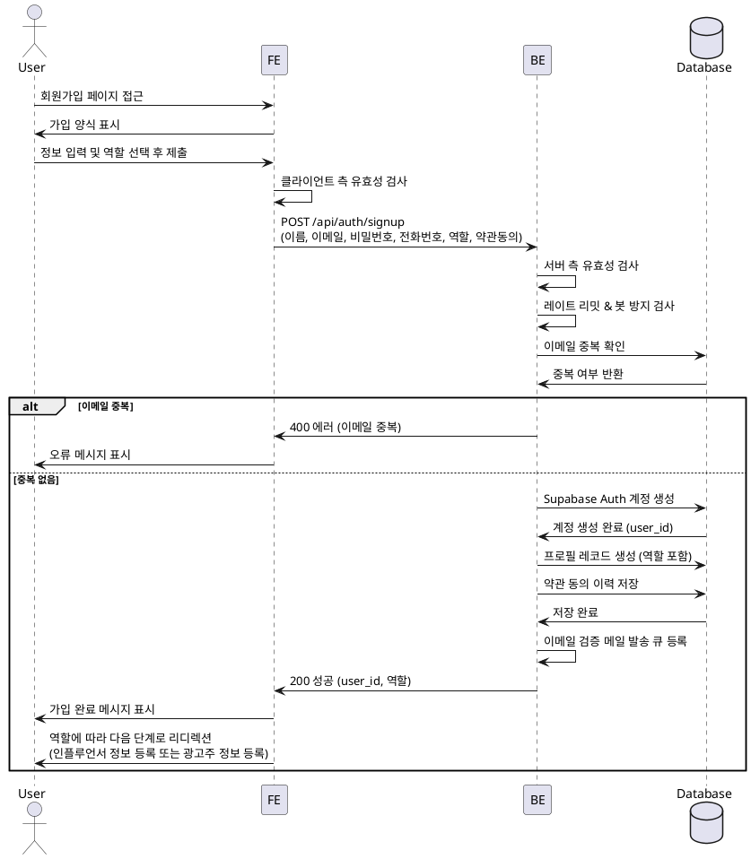

# 001 - 회원가입 & 역할선택

## Primary Actor

- 신규 사용자 (광고주 또는 인플루언서가 되고자 하는 사람)

## Precondition

- 사용자가 서비스 URL에 접근할 수 있다.
- 사용자가 유효한 이메일 또는 외부 인증 수단을 보유하고 있다.

## Trigger

- 사용자가 회원가입 페이지에 접근하여 가입 프로세스를 시작한다.

## Main Scenario

1. 사용자가 회원가입 페이지에 접근한다.
2. 시스템은 가입 양식을 표시한다 (이름, 휴대폰번호, 이메일, 비밀번호, 약관동의, 역할 선택).
3. 사용자가 필수 정보를 입력하고 역할(광고주/인플루언서)을 선택한다.
4. 사용자가 약관에 동의하고 가입 버튼을 클릭한다.
5. 시스템은 입력된 정보의 유효성을 검사한다.
6. 시스템은 Supabase Auth를 통해 계정을 생성한다.
7. 시스템은 사용자 프로필 레코드를 생성하고 역할을 저장한다.
8. 시스템은 약관 동의 이력을 저장한다.
9. 시스템은 이메일 검증 메일을 발송한다.
10. 시스템은 가입 완료 메시지를 표시하고, 선택한 역할에 따라 다음 단계(인플루언서 정보 등록 또는 광고주 정보 등록)로 리디렉션한다.

## Edge Cases

- **이메일 중복**: 이미 가입된 이메일인 경우 오류 메시지 표시.
- **유효성 검사 실패**: 이메일 형식, 휴대폰번호 형식, 비밀번호 강도 등이 기준에 미달하면 필드별 오류 표시.
- **약관 미동의**: 필수 약관에 동의하지 않으면 가입 버튼 비활성화 또는 오류 메시지 표시.
- **레이트 리밋 초과**: 짧은 시간 내 과도한 가입 시도 시 일시적으로 차단.
- **봇 방지**: reCAPTCHA 등을 통해 봇 가입 시도를 차단.
- **이메일 발송 실패**: 이메일 서비스 장애 시 재시도 또는 관리자 알림.

## Business Rules

- 사용자는 광고주 또는 인플루언서 중 하나의 역할을 반드시 선택해야 한다.
- 이메일은 계정의 고유 식별자로 사용되며 중복이 허용되지 않는다.
- 필수 약관에 동의하지 않으면 가입이 불가능하다.
- 이메일 검증이 완료되기 전까지 일부 기능 접근이 제한될 수 있다.
- 가입 후 역할에 따라 추가 정보 등록 단계로 진행된다 (인플루언서 → 채널 등록, 광고주 → 업체 정보 등록).

## Sequence Diagram

