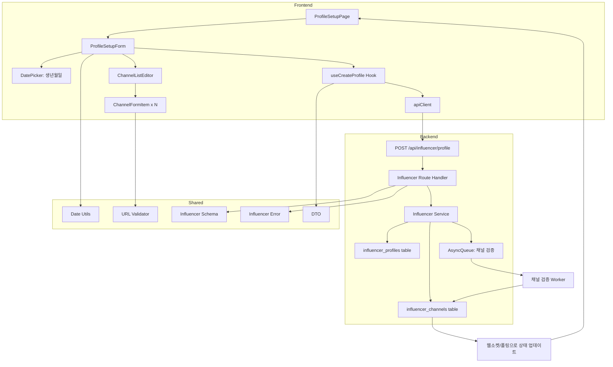

# 002 - 인플루언서 정보 등록 구현 계획

## 개요

### 모듈 목록

| 모듈명 | 위치 | 설명 |
|--------|------|------|
| **Backend: Influencer Service** | `src/features/influencer/backend/service.ts` | 인플루언서 프로필 및 채널 등록 로직 |
| **Backend: Influencer Route** | `src/features/influencer/backend/route.ts` | 인플루언서 프로필 API 엔드포인트 |
| **Backend: Influencer Schema** | `src/features/influencer/backend/schema.ts` | 프로필/채널 요청/응답 스키마 (Zod) |
| **Backend: Influencer Error** | `src/features/influencer/backend/error.ts` | 인플루언서 관련 에러 코드 |
| **Frontend: Profile Setup Page** | `src/app/influencer/profile/setup/page.tsx` | 인플루언서 정보 등록 페이지 |
| **Frontend: Profile Setup Form** | `src/features/influencer/components/profile-setup-form.tsx` | 정보 입력 양식 (생년월일, 채널) |
| **Frontend: Channel List Editor** | `src/features/influencer/components/channel-list-editor.tsx` | 채널 추가/편집/삭제 UI |
| **Frontend: Channel Form Item** | `src/features/influencer/components/channel-form-item.tsx` | 개별 채널 입력 폼 |
| **Frontend: useCreateProfile** | `src/features/influencer/hooks/useCreateProfile.ts` | 프로필 생성 mutation hook |
| **DTO Export** | `src/features/influencer/lib/dto.ts` | 백엔드 스키마 재노출 |
| **Shared: Date Utils** | `src/lib/date.ts` | 날짜 포맷 및 나이 계산 유틸 (date-fns) |
| **Shared: URL Validator** | `src/lib/validation.ts` | URL 형식 및 플랫폼별 검증 |
| **Constants: Platforms** | `src/features/influencer/constants/platforms.ts` | 지원 플랫폼 메타데이터 |
| **Async Queue (Placeholder)** | `src/backend/queue/channel-verification.ts` | 채널 검증 비동기 작업 (추후 구현) |

---

## Diagram



---

## Implementation Plan

### 1. Backend Layer

#### 1.1 Schema 정의 (`src/features/influencer/backend/schema.ts`)

**파일 생성**
- `ChannelInputSchema`: 채널 입력 데이터
  - platform: 'naver' | 'youtube' | 'instagram' | 'threads'
  - channelName: string (min 1자)
  - channelUrl: string (URL 형식)
- `CreateInfluencerProfileRequestSchema`: 프로필 생성 요청
  - birthDate: string (YYYY-MM-DD)
  - channels: ChannelInputSchema[] (최소 1개)
- `ChannelResponseSchema`: 채널 응답 데이터
  - id: UUID
  - platform: string
  - channelName: string
  - channelUrl: string
  - verificationStatus: 'pending' | 'verified' | 'failed'
- `CreateInfluencerProfileResponseSchema`: 프로필 생성 응답
  - profileId: UUID
  - channels: ChannelResponseSchema[]

**Unit Tests**
- 유효한 데이터 파싱 성공
- 생년월일 형식 검증 (YYYY-MM-DD)
- 나이 정책 검증 (만 14세 이상)
- 채널 배열 최소 1개 이상
- URL 형식 검증

#### 1.2 Error 정의 (`src/features/influencer/backend/error.ts`)

**파일 생성**
- `influencerErrorCodes` 객체
  - `profileAlreadyExists`: 프로필 이미 존재
  - `invalidBirthDate`: 유효하지 않은 생년월일
  - `agePolicyViolation`: 나이 제한 위반 (만 14세 미만)
  - `duplicateChannelUrl`: 중복 채널 URL
  - `invalidChannelUrl`: 유효하지 않은 채널 URL
  - `databaseError`: DB 저장 실패
  - `channelVerificationFailed`: 채널 검증 실패

#### 1.3 Service 로직 (`src/features/influencer/backend/service.ts`)

**파일 생성**
- `createInfluencerProfile` 함수
  1. 요청한 사용자의 userId 추출 (컨텍스트에서)
  2. 이미 프로필이 존재하는지 확인
  3. 생년월일 검증 (나이 정책)
  4. 채널 URL 중복 검증
  5. `influencer_profiles` 테이블에 프로필 생성
  6. `influencer_channels` 테이블에 채널 목록 일괄 생성 (상태: pending)
  7. 채널 검증 작업을 큐에 등록 (비동기)
  8. 생성된 프로필 및 채널 정보 반환

**Unit Tests**
- 정상 케이스: 프로필 및 채널 생성 성공
- 프로필 중복: `profileAlreadyExists` 에러
- 나이 제한 위반: `agePolicyViolation` 에러
- 중복 채널 URL: `duplicateChannelUrl` 에러
- DB 저장 실패: `databaseError` 에러

#### 1.4 Route Handler (`src/features/influencer/backend/route.ts`)

**파일 생성**
- `POST /api/influencer/profile` 엔드포인트
  1. 인증 미들웨어로 사용자 확인
  2. 역할이 'influencer'인지 검증
  3. 요청 body를 `CreateInfluencerProfileRequestSchema`로 파싱
  4. `createInfluencerProfile` 서비스 호출
  5. 성공: 201 응답 (profileId, channels)
  6. 실패: 적절한 HTTP 상태 코드와 에러 메시지

**Integration Tests**
- 정상 요청: 201 응답 및 프로필 생성 확인
- 비인증 사용자: 401 응답
- 광고주 역할: 403 응답
- 유효성 검사 실패: 400 응답
- 프로필 중복: 409 응답

#### 1.5 Hono App 통합 (`src/backend/hono/app.ts`)

**파일 수정**
- `registerInfluencerRoutes(app)` 추가

#### 1.6 Async Queue (Placeholder) (`src/backend/queue/channel-verification.ts`)

**파일 생성 (추후 구현)**
- `enqueueChannelVerification(channelId: string)` 함수
- 실제 검증 로직은 추후 외부 API 연동 시 구현
- 현재는 로깅만 수행

---

### 2. Frontend Layer

#### 2.1 Date Utils (`src/lib/date.ts`)

**파일 생성**
- `calculateAge(birthDate: string): number` (date-fns 사용)
- `formatDate(date: Date, format: string): string`
- `isValidDateFormat(dateStr: string): boolean`

#### 2.2 URL Validator 확장 (`src/lib/validation.ts`)

**파일 수정**
- `validateChannelUrl(url: string, platform: string): boolean`
  - 플랫폼별 URL 패턴 검증
  - 예: 네이버 블로그 `blog.naver.com`, 유튜브 `youtube.com/@` 등

#### 2.3 Platform Constants (`src/features/influencer/constants/platforms.ts`)

**파일 생성**
- `SUPPORTED_PLATFORMS`: 플랫폼 배열
  - label: "네이버 블로그", value: "naver", icon: naver-icon 등
- `PLATFORM_URL_PATTERNS`: 플랫폼별 URL 정규식

#### 2.4 DTO Export (`src/features/influencer/lib/dto.ts`)

**파일 생성**
```ts
export type { CreateInfluencerProfileRequest, ChannelInput, ChannelResponse } from '../backend/schema';
export { CreateInfluencerProfileRequestSchema, ChannelInputSchema } from '../backend/schema';
```

#### 2.5 useCreateProfile Hook (`src/features/influencer/hooks/useCreateProfile.ts`)

**파일 생성**
- `useCreateProfile` mutation hook
  - `apiClient.post('/api/influencer/profile', data)`
  - 성공 시 홈으로 리디렉션 및 성공 toast
  - 에러 시 에러 메시지 toast

#### 2.6 Channel Form Item (`src/features/influencer/components/channel-form-item.tsx`)

**파일 생성**
- Props: `index: number`, `value: ChannelInput`, `onChange: (value: ChannelInput) => void`, `onRemove: () => void`
- 플랫폼 선택 (Select)
- 채널명 입력 (Input)
- 채널 URL 입력 (Input)
- 삭제 버튼 (Button)
- 유효성 검사 피드백

**QA Sheet**
| 항목 | 기대 동작 |
|------|----------|
| 플랫폼 선택 | 선택 시 onChange 호출 |
| 채널명 입력 | 실시간 onChange 호출 |
| 채널 URL 입력 | 유효성 검사 및 에러 표시 |
| 삭제 버튼 클릭 | onRemove 호출 및 항목 제거 |
| URL 형식 오류 | "올바른 URL 형식이 아닙니다" 표시 |

#### 2.7 Channel List Editor (`src/features/influencer/components/channel-list-editor.tsx`)

**파일 생성**
- Props: `value: ChannelInput[]`, `onChange: (channels: ChannelInput[]) => void`
- 채널 목록 렌더링 (각 `ChannelFormItem`)
- "채널 추가" 버튼
- 최소 1개 이상 제약 (삭제 시 경고)

**QA Sheet**
| 항목 | 기대 동작 |
|------|----------|
| 채널 추가 | 새 빈 채널 폼 추가 |
| 채널 삭제 | 해당 채널 제거 (1개 이상 유지) |
| 마지막 채널 삭제 시도 | "최소 1개 이상의 채널이 필요합니다" 경고 |

#### 2.8 Profile Setup Form (`src/features/influencer/components/profile-setup-form.tsx`)

**파일 생성**
- react-hook-form + zod resolver
- 필드: birthDate (DatePicker), channels (ChannelListEditor)
- 클라이언트 측 유효성 검사 (나이, URL 형식)
- `useCreateProfile` hook 호출
- 제출 버튼 로딩 상태
- 에러 메시지 필드별 표시

**QA Sheet**
| 항목 | 기대 동작 |
|------|----------|
| 생년월일 선택 | DatePicker 동작 및 유효성 검사 |
| 만 14세 미만 입력 | "만 14세 이상만 가입 가능합니다" 표시 |
| 채널 URL 중복 | "중복된 채널 URL입니다" 표시 |
| 제출 성공 | 홈으로 리디렉션 및 성공 메시지 |
| 제출 실패 | 에러 메시지 toast 표시 |

#### 2.9 Profile Setup Page (`src/app/influencer/profile/setup/page.tsx`)

**파일 생성**
- `'use client'` 지시어
- 인플루언서 역할 확인 (guard)
- 이미 프로필이 있으면 홈으로 리디렉션
- `<ProfileSetupForm />` 렌더링

**QA Sheet**
| 항목 | 기대 동작 |
|------|----------|
| 비로그인 사용자 | 로그인 페이지로 리디렉션 |
| 광고주 역할 | 접근 거부 메시지 |
| 인플루언서 & 프로필 없음 | 정보 입력 양식 표시 |
| 인플루언서 & 프로필 있음 | 홈으로 리디렉션 |

---

### 3. Shared Modules

#### 3.1 Date Utils (`src/lib/date.ts`)

**새 파일 생성**
- date-fns 기반 유틸 함수

#### 3.2 Validation Utils (`src/lib/validation.ts`)

**기존 파일 확장**
- URL 검증 함수 추가

---

### 4. Database Migration

**이미 존재함**
- `influencer_profiles`, `influencer_channels` 테이블 정의됨
- 추가 마이그레이션 불필요

---

## 작업 순서

1. **Shared**: Date Utils 작성, Validation Utils 확장
2. **Backend**: Schema → Error → Service → Route 순서로 작성
3. **Backend**: Async Queue Placeholder 작성
4. **Backend**: Hono App에 라우터 등록
5. **Frontend**: Constants → DTO → Hook → Components 순서로 작성
6. **Frontend**: Page 통합
7. **E2E**: 수동 QA 및 채널 검증 플로우 확인

---

## 주요 고려사항

- **나이 제한**: 만 14세 이상 정책 엄격히 적용
- **채널 검증**: 초기에는 큐 등록만 하고 실제 검증은 추후 구현
- **URL 중복**: 동일 사용자 내 중복뿐 아니라 전체 사용자 대상 중복 검증 가능
- **상태 업데이트**: 채널 검증 결과는 웹소켓 또는 폴링으로 실시간 반영 (추후 확장)
- **트랜잭션**: 프로필 및 채널 생성은 트랜잭션으로 원자성 보장
- **임시저장**: 필요 시 로컬스토리지 활용하여 구현 (선택적)