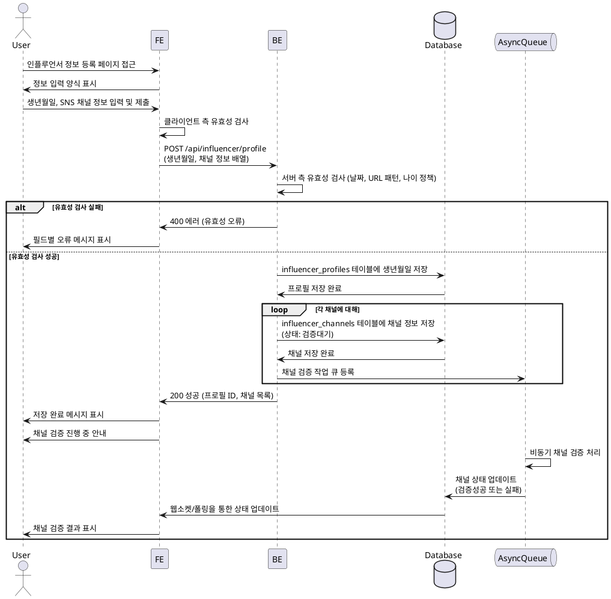

# 002 - 인플루언서 정보 등록

## Primary Actor

- 인플루언서 역할로 가입한 사용자

## Precondition

- 사용자가 회원가입을 완료하고 인플루언서 역할을 선택했다.
- 사용자가 로그인되어 있다.

## Trigger

- 회원가입 완료 후 인플루언서 정보 등록 페이지로 리디렉션되거나, 사용자가 프로필 설정에서 정보 등록을 시작한다.

## Main Scenario

1. 사용자가 인플루언서 정보 등록 페이지에 접근한다.
2. 시스템은 정보 입력 양식을 표시한다 (생년월일, SNS 채널 정보).
3. 사용자가 생년월일을 입력한다.
4. 사용자가 SNS 채널 유형(블로그, 인스타그램, 유튜브 등)을 선택하고, 채널명과 URL을 입력한다.
5. 사용자는 여러 채널을 추가, 편집, 삭제할 수 있다.
6. 사용자가 "제출" 버튼을 클릭한다.
7. 시스템은 입력된 정보의 유효성을 검사한다 (날짜 형식, URL 패턴, 나이 정책).
8. 시스템은 `influencer_profiles` 테이블에 생년월일을 저장한다.
9. 시스템은 각 채널 정보를 `influencer_channels` 테이블에 저장한다.
10. 시스템은 채널 검증을 위한 비동기 작업을 큐에 등록한다.
11. 시스템은 저장 완료 메시지를 표시하고, 채널 검증 진행 상태를 안내한다.
12. 사용자는 홈 화면으로 이동하며, 체험단 지원 가능 상태가 된다.

## Edge Cases

- **나이 제한**: 만 14세 미만 등 정책에 맞지 않는 생년월일 입력 시 오류 표시.
- **URL 형식 오류**: 잘못된 URL 형식 입력 시 필드별 오류 메시지 표시.
- **중복 채널**: 동일한 채널 URL을 여러 번 등록하려는 경우 경고 및 차단.
- **임시저장**: 사용자가 "임시저장" 버튼 클릭 시 입력 중인 정보를 저장하고 나중에 이어서 작성 가능.
- **채널 검증 실패**: 비동기 검증 결과 채널이 존재하지 않거나 접근 불가능한 경우 상태를 "실패"로 표시하고 사용자에게 알림.
- **메트릭 수집 실패**: 외부 API 호출 실패 시에도 기본 정보는 저장되며, 메트릭은 선택적으로 처리.

## Business Rules

- 인플루언서는 반드시 생년월일과 최소 1개 이상의 SNS 채널을 등록해야 체험단 지원이 가능하다.
- 나이 제한 정책을 충족해야 한다 (예: 만 14세 이상).
- 각 채널은 고유한 URL을 가져야 하며, 중복 등록이 불가능하다.
- 채널 검증은 비동기로 처리되며, 검증 완료 전까지는 "검증대기" 상태로 표시된다.
- 검증에 실패한 채널은 체험단 지원 시 제외될 수 있다.

## Sequence Diagram

