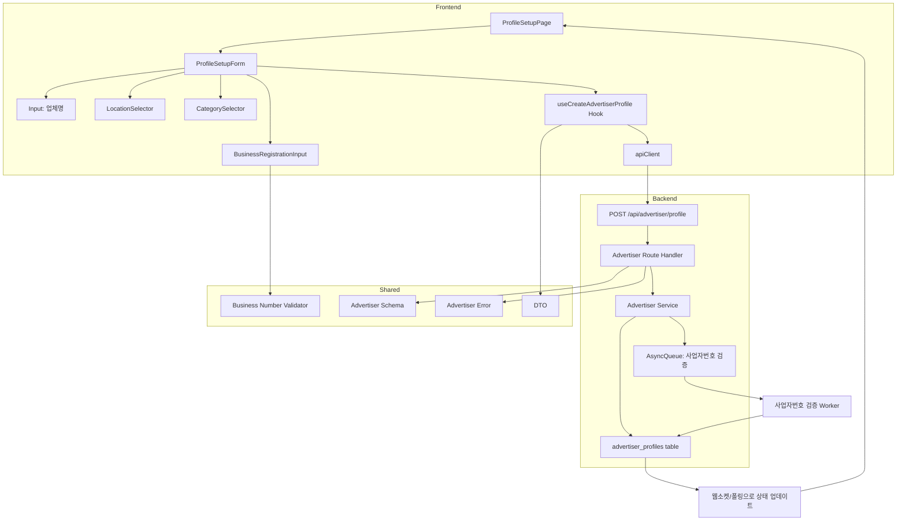

# 003 - 광고주 정보 등록 구현 계획

## 개요

### 모듈 목록

| 모듈명 | 위치 | 설명 |
|--------|------|------|
| **Backend: Advertiser Service** | `src/features/advertiser/backend/service.ts` | 광고주 프로필 등록 로직 |
| **Backend: Advertiser Route** | `src/features/advertiser/backend/route.ts` | 광고주 프로필 API 엔드포인트 |
| **Backend: Advertiser Schema** | `src/features/advertiser/backend/schema.ts` | 프로필 요청/응답 스키마 (Zod) |
| **Backend: Advertiser Error** | `src/features/advertiser/backend/error.ts` | 광고주 관련 에러 코드 |
| **Frontend: Profile Setup Page** | `src/app/advertiser/profile/setup/page.tsx` | 광고주 정보 등록 페이지 |
| **Frontend: Profile Setup Form** | `src/features/advertiser/components/profile-setup-form.tsx` | 업체 정보 입력 양식 |
| **Frontend: Business Registration Input** | `src/features/advertiser/components/business-registration-input.tsx` | 사업자등록번호 입력 컴포넌트 |
| **Frontend: Location Selector** | `src/features/advertiser/components/location-selector.tsx` | 위치 선택/입력 UI |
| **Frontend: Category Selector** | `src/features/advertiser/components/category-selector.tsx` | 카테고리 선택 UI |
| **Frontend: useCreateAdvertiserProfile** | `src/features/advertiser/hooks/useCreateAdvertiserProfile.ts` | 프로필 생성 mutation hook |
| **DTO Export** | `src/features/advertiser/lib/dto.ts` | 백엔드 스키마 재노출 |
| **Shared: Business Number Validator** | `src/lib/validation.ts` | 사업자등록번호 형식 검증 |
| **Constants: Categories** | `src/features/advertiser/constants/categories.ts` | 업체 카테고리 메타데이터 |
| **Async Queue (Placeholder)** | `src/backend/queue/business-verification.ts` | 사업자번호 검증 비동기 작업 |

---

## Diagram



---

## Implementation Plan

### 1. Backend Layer

#### 1.1 Schema 정의 (`src/features/advertiser/backend/schema.ts`)

**파일 생성**
- `CreateAdvertiserProfileRequestSchema`: 프로필 생성 요청
  - businessName: string (min 1자)
  - location: string (min 1자)
  - category: string (enum)
  - businessRegistrationNumber: string (10자리 숫자, 하이픈 제외)
- `CreateAdvertiserProfileResponseSchema`: 프로필 생성 응답
  - profileId: UUID
  - verificationStatus: 'pending' | 'verified' | 'failed'

**Unit Tests**
- 유효한 데이터 파싱 성공
- 사업자등록번호 형식 검증 (10자리 숫자)
- 카테고리 enum 검증

#### 1.2 Error 정의 (`src/features/advertiser/backend/error.ts`)

**파일 생성**
- `advertiserErrorCodes` 객체
  - `profileAlreadyExists`: 프로필 이미 존재
  - `businessNumberAlreadyRegistered`: 사업자등록번호 중복
  - `invalidBusinessNumber`: 유효하지 않은 사업자등록번호 형식
  - `databaseError`: DB 저장 실패
  - `verificationFailed`: 외부 검증 실패

#### 1.3 Service 로직 (`src/features/advertiser/backend/service.ts`)

**파일 생성**
- `createAdvertiserProfile` 함수
  1. 요청한 사용자의 userId 추출
  2. 이미 프로필이 존재하는지 확인
  3. 사업자등록번호 중복 확인 (전체 테이블 대상)
  4. 사업자등록번호 형식 검증
  5. `advertiser_profiles` 테이블에 프로필 생성 (상태: pending)
  6. 사업자번호 검증 작업을 큐에 등록 (비동기)
  7. 생성된 프로필 정보 반환

**Unit Tests**
- 정상 케이스: 프로필 생성 성공
- 프로필 중복: `profileAlreadyExists` 에러
- 사업자등록번호 중복: `businessNumberAlreadyRegistered` 에러
- 형식 오류: `invalidBusinessNumber` 에러
- DB 저장 실패: `databaseError` 에러

#### 1.4 Route Handler (`src/features/advertiser/backend/route.ts`)

**파일 생성**
- `POST /api/advertiser/profile` 엔드포인트
  1. 인증 미들웨어로 사용자 확인
  2. 역할이 'advertiser'인지 검증
  3. 요청 body를 `CreateAdvertiserProfileRequestSchema`로 파싱
  4. `createAdvertiserProfile` 서비스 호출
  5. 성공: 201 응답 (profileId, verificationStatus)
  6. 실패: 적절한 HTTP 상태 코드와 에러 메시지

**Integration Tests**
- 정상 요청: 201 응답 및 프로필 생성 확인
- 비인증 사용자: 401 응답
- 인플루언서 역할: 403 응답
- 유효성 검사 실패: 400 응답
- 사업자등록번호 중복: 409 응답

#### 1.5 Hono App 통합 (`src/backend/hono/app.ts`)

**파일 수정**
- `registerAdvertiserRoutes(app)` 추가

#### 1.6 Async Queue (Placeholder) (`src/backend/queue/business-verification.ts`)

**파일 생성 (추후 구현)**
- `enqueueBusinessVerification(profileId: string)` 함수
- 실제 검증 로직은 추후 공공 API 연동 시 구현
- 현재는 로깅만 수행

---

### 2. Frontend Layer

#### 2.1 Business Number Validator (`src/lib/validation.ts`)

**파일 확장**
- `validateBusinessNumber(number: string): boolean`
  - 10자리 숫자 검증
  - 체크섬 알고리즘 적용 (선택적)

#### 2.2 Category Constants (`src/features/advertiser/constants/categories.ts`)

**파일 생성**
- `BUSINESS_CATEGORIES`: 카테고리 배열
  - label: "음식점", value: "restaurant"
  - label: "카페", value: "cafe"
  - label: "뷰티", value: "beauty" 등

#### 2.3 DTO Export (`src/features/advertiser/lib/dto.ts`)

**파일 생성**
```ts
export type { CreateAdvertiserProfileRequest, CreateAdvertiserProfileResponse } from '../backend/schema';
export { CreateAdvertiserProfileRequestSchema } from '../backend/schema';
```

#### 2.4 useCreateAdvertiserProfile Hook (`src/features/advertiser/hooks/useCreateAdvertiserProfile.ts`)

**파일 생성**
- `useCreateAdvertiserProfile` mutation hook
  - `apiClient.post('/api/advertiser/profile', data)`
  - 성공 시 홈으로 리디렉션 및 성공 toast
  - 에러 시 에러 메시지 toast

#### 2.5 Business Registration Input (`src/features/advertiser/components/business-registration-input.tsx`)

**파일 생성**
- Props: `value: string`, `onChange: (value: string) => void`, `error?: string`
- 사업자등록번호 입력 (10자리)
- 자동 하이픈 삽입 (예: 123-45-67890)
- 실시간 유효성 검사

**QA Sheet**
| 항목 | 기대 동작 |
|------|----------|
| 숫자 입력 | 10자리까지 입력 가능 |
| 하이픈 자동 삽입 | 3-2-5 형식으로 표시 |
| 형식 오류 | "올바른 사업자등록번호 형식이 아닙니다" 표시 |
| 복사/붙여넣기 | 하이픈 자동 제거 및 포맷팅 |

#### 2.6 Location Selector (`src/features/advertiser/components/location-selector.tsx`)

**파일 생성**
- Props: `value: string`, `onChange: (value: string) => void`
- 주소 검색 API 연동 (선택적, 초기에는 수동 입력)
- Input 또는 Combobox 사용

**QA Sheet**
| 항목 | 기대 동작 |
|------|----------|
| 위치 입력 | 텍스트 입력 가능 |
| (선택적) 주소 검색 | 다음 주소 API 연동 |

#### 2.7 Category Selector (`src/features/advertiser/components/category-selector.tsx`)

**파일 생성**
- Props: `value: string`, `onChange: (value: string) => void`
- Select 컴포넌트로 카테고리 선택
- `BUSINESS_CATEGORIES` 상수 사용

**QA Sheet**
| 항목 | 기대 동작 |
|------|----------|
| 카테고리 선택 | Select 드롭다운 동작 |
| 초기값 없음 | "카테고리를 선택하세요" placeholder |

#### 2.8 Profile Setup Form (`src/features/advertiser/components/profile-setup-form.tsx`)

**파일 생성**
- react-hook-form + zod resolver
- 필드: businessName, location, category, businessRegistrationNumber
- 클라이언트 측 유효성 검사
- `useCreateAdvertiserProfile` hook 호출
- 제출 버튼 로딩 상태
- 에러 메시지 필드별 표시

**QA Sheet**
| 항목 | 기대 동작 |
|------|----------|
| 모든 필드 입력 | 제출 버튼 활성화 |
| 사업자등록번호 중복 | "이미 등록된 사업자등록번호입니다" 표시 |
| 제출 성공 | 홈으로 리디렉션 및 성공 메시지 |
| 제출 실패 | 에러 메시지 toast 표시 |

#### 2.9 Profile Setup Page (`src/app/advertiser/profile/setup/page.tsx`)

**파일 생성**
- `'use client'` 지시어
- 광고주 역할 확인 (guard)
- 이미 프로필이 있으면 홈으로 리디렉션
- `<ProfileSetupForm />` 렌더링

**QA Sheet**
| 항목 | 기대 동작 |
|------|----------|
| 비로그인 사용자 | 로그인 페이지로 리디렉션 |
| 인플루언서 역할 | 접근 거부 메시지 |
| 광고주 & 프로필 없음 | 정보 입력 양식 표시 |
| 광고주 & 프로필 있음 | 홈으로 리디렉션 |

---

### 3. Shared Modules

#### 3.1 Validation Utils (`src/lib/validation.ts`)

**기존 파일 확장**
- 사업자등록번호 검증 함수 추가

---

### 4. Database Migration

**이미 존재함**
- `advertiser_profiles` 테이블 정의됨
- 추가 마이그레이션 불필요

---

## 작업 순서

1. **Shared**: Validation Utils 확장 (사업자등록번호)
2. **Backend**: Schema → Error → Service → Route 순서로 작성
3. **Backend**: Async Queue Placeholder 작성
4. **Backend**: Hono App에 라우터 등록
5. **Frontend**: Constants → DTO → Hook → Components 순서로 작성
6. **Frontend**: Page 통합
7. **E2E**: 수동 QA 및 사업자번호 검증 플로우 확인

---

## 주요 고려사항

- **사업자등록번호 중복**: 전체 사용자 대상으로 중복 검증 (unique 제약)
- **외부 API 검증**: 초기에는 큐 등록만 하고 실제 검증은 추후 구현
- **위치 정보**: 주소 검색 API 연동은 선택적 (초기에는 수동 입력)
- **상태 업데이트**: 검증 결과는 웹소켓 또는 폴링으로 실시간 반영 (추후 확장)
- **임시저장**: 필요 시 로컬스토리지 활용 (선택적)
- **체험단 등록 권한**: 프로필 검증 완료 후에만 체험단 등록 가능