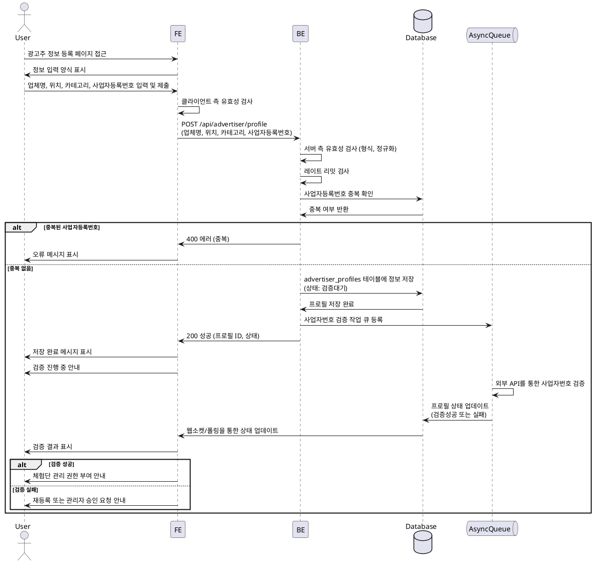

# 003 - 광고주 정보 등록

## Primary Actor

- 광고주 역할로 가입한 사용자

## Precondition

- 사용자가 회원가입을 완료하고 광고주 역할을 선택했다.
- 사용자가 로그인되어 있다.

## Trigger

- 회원가입 완료 후 광고주 정보 등록 페이지로 리디렉션되거나, 사용자가 프로필 설정에서 정보 등록을 시작한다.

## Main Scenario

1. 사용자가 광고주 정보 등록 페이지에 접근한다.
2. 시스템은 정보 입력 양식을 표시한다 (업체명, 위치, 카테고리, 사업자등록번호).
3. 사용자가 업체명을 입력한다.
4. 사용자가 업체 위치를 입력하거나 선택한다.
5. 사용자가 업체 카테고리를 선택한다 (음식점, 카페, 뷰티 등).
6. 사용자가 사업자등록번호를 입력한다.
7. 사용자가 "제출" 버튼을 클릭한다.
8. 시스템은 입력된 정보의 유효성을 검사한다 (필드 정규화, 사업자등록번호 형식).
9. 시스템은 사업자등록번호 중복 여부를 확인한다.
10. 시스템은 `advertiser_profiles` 테이블에 정보를 저장한다.
11. 시스템은 외부 사업자번호 검증을 위한 비동기 작업을 큐에 등록한다.
12. 시스템은 저장 완료 메시지를 표시하고, 검증 진행 상태를 안내한다.
13. 사용자는 체험단 관리 권한을 부여받고 홈 화면으로 이동한다.

## Edge Cases

- **사업자등록번호 형식 오류**: 유효하지 않은 형식 입력 시 오류 메시지 표시.
- **중복 사업자등록번호**: 이미 등록된 사업자등록번호인 경우 오류 메시지 표시 및 등록 차단.
- **임시저장**: 사용자가 "임시저장" 버튼 클릭 시 입력 중인 정보를 저장하고 나중에 이어서 작성 가능.
- **외부 검증 실패**: 공공 API 호출 결과 사업자등록번호가 유효하지 않거나 폐업 상태인 경우 상태를 "실패"로 표시하고 사용자에게 알림.
- **레이트 리밋**: 짧은 시간 내 과도한 등록 시도 시 일시적으로 차단.
- **위치 정보 오류**: 주소 검색 실패 시 수동 입력 옵션 제공.

## Business Rules

- 광고주는 반드시 업체명, 위치, 카테고리, 사업자등록번호를 모두 입력해야 체험단 등록이 가능하다.
- 사업자등록번호는 고유해야 하며, 중복 등록이 불가능하다.
- 사업자등록번호는 외부 API를 통해 검증되며, 검증 완료 전까지는 "검증대기" 상태로 표시된다.
- 검증에 실패한 경우 관리자 승인을 요청하거나 재등록이 필요할 수 있다.
- 프로필 확정 후에만 체험단 관리 권한이 부여된다.

## Sequence Diagram

