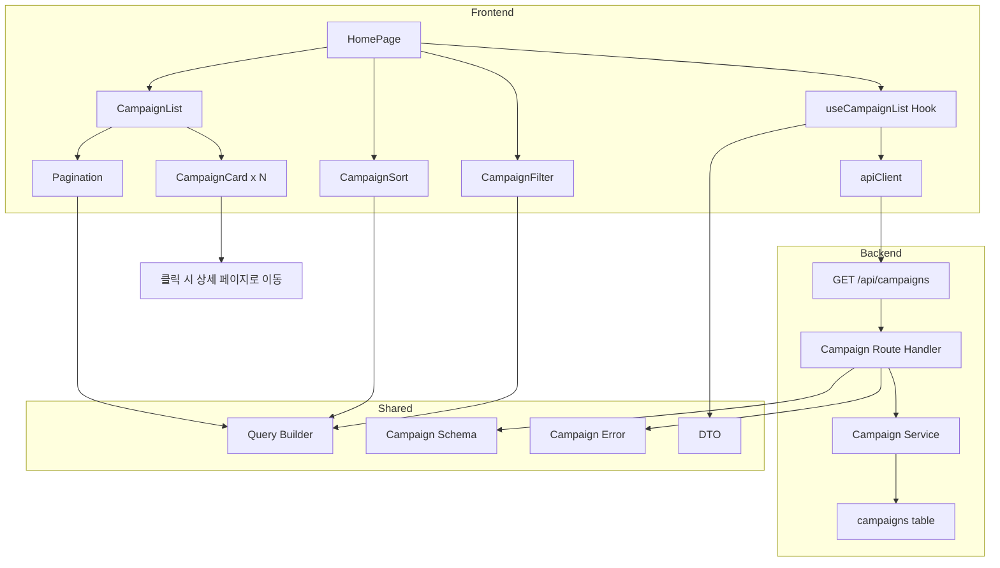

# 004 - 홈 & 체험단 목록 탐색 구현 계획

## 개요

### 모듈 목록

| 모듈명 | 위치 | 설명 |
|--------|------|------|
| **Backend: Campaign Service** | `src/features/campaign/backend/service.ts` | 체험단 목록 조회 로직 |
| **Backend: Campaign Route** | `src/features/campaign/backend/route.ts` | 체험단 목록 API 엔드포인트 |
| **Backend: Campaign Schema** | `src/features/campaign/backend/schema.ts` | 목록 조회 요청/응답 스키마 (Zod) |
| **Backend: Campaign Error** | `src/features/campaign/backend/error.ts` | 체험단 관련 에러 코드 |
| **Frontend: Home Page** | `src/app/page.tsx` | 홈 페이지 (체험단 목록) |
| **Frontend: Campaign List** | `src/features/campaign/components/campaign-list.tsx` | 체험단 카드 목록 컴포넌트 |
| **Frontend: Campaign Card** | `src/features/campaign/components/campaign-card.tsx` | 개별 체험단 카드 컴포넌트 |
| **Frontend: Campaign Filter** | `src/features/campaign/components/campaign-filter.tsx` | 필터 UI (카테고리, 지역, 상태) |
| **Frontend: Campaign Sort** | `src/features/campaign/components/campaign-sort.tsx` | 정렬 UI (최신순, 마감임박순 등) |
| **Frontend: useCampaignList** | `src/features/campaign/hooks/useCampaignList.ts` | 목록 조회 React Query hook |
| **DTO Export** | `src/features/campaign/lib/dto.ts` | 백엔드 스키마 재노출 |
| **Shared: Query Builder** | `src/lib/query-builder.ts` | 쿼리 파라미터 빌더 유틸 |
| **Shared: Pagination** | `src/components/shared/pagination.tsx` | 페이지네이션 또는 무한 스크롤 컴포넌트 |

---

## Diagram



---

## Implementation Plan

### 1. Backend Layer

#### 1.1 Schema 정의 (`src/features/campaign/backend/schema.ts`)

**파일 생성**
- `CampaignListQuerySchema`: 목록 조회 쿼리 파라미터
  - status?: 'recruiting' | 'closed' | 'selection_complete' (기본값: recruiting)
  - category?: string
  - location?: string
  - sort?: 'latest' | 'deadline_soon' | 'popular' (기본값: latest)
  - page?: number (기본값: 1)
  - limit?: number (기본값: 20)
- `CampaignSummarySchema`: 개별 체험단 요약 정보
  - id: UUID
  - title: string
  - category: string
  - location: string
  - recruitmentEndDate: string (ISO 8601)
  - recruitmentCount: number
  - applicationCount: number (계산 필드)
  - thumbnail?: string (선택적)
  - status: string
- `CampaignListResponseSchema`: 목록 조회 응답
  - campaigns: CampaignSummarySchema[]
  - pagination: { page: number, limit: number, total: number }

**Unit Tests**
- 쿼리 파라미터 기본값 적용
- 페이지네이션 파라미터 검증
- 정렬 옵션 enum 검증

#### 1.2 Error 정의 (`src/features/campaign/backend/error.ts`)

**파일 생성**
- `campaignErrorCodes` 객체
  - `fetchError`: DB 조회 실패
  - `invalidQuery`: 유효하지 않은 쿼리 파라미터

#### 1.3 Service 로직 (`src/features/campaign/backend/service.ts`)

**파일 생성**
- `getCampaignList` 함수
  1. 쿼리 파라미터 파싱 (status, category, location, sort, page, limit)
  2. `campaigns` 테이블 조회
  3. 필터 적용 (status, category, location)
  4. 정렬 적용 (latest: created_at DESC, deadline_soon: recruitment_end_date ASC)
  5. 페이지네이션 적용 (offset, limit)
  6. 각 체험단의 지원자 수 계산 (JOIN applications)
  7. 총 개수 조회 (count)
  8. 결과 반환

**Unit Tests**
- 정상 케이스: 목록 조회 성공
- 필터 적용: 카테고리/지역별 필터링 확인
- 정렬 적용: 최신순/마감임박순 정렬 확인
- 페이지네이션: offset/limit 적용 확인
- DB 조회 실패: `fetchError` 에러

#### 1.4 Route Handler (`src/features/campaign/backend/route.ts`)

**파일 생성**
- `GET /api/campaigns` 엔드포인트
  1. 쿼리 파라미터를 `CampaignListQuerySchema`로 파싱
  2. `getCampaignList` 서비스 호출
  3. 성공: 200 응답 (campaigns, pagination)
  4. 실패: 적절한 HTTP 상태 코드와 에러 메시지

**Integration Tests**
- 정상 요청: 200 응답 및 목록 반환
- 필터 쿼리: 카테고리/지역 필터링 확인
- 정렬 쿼리: 정렬 옵션 적용 확인
- 페이지네이션: 페이지별 데이터 반환 확인

#### 1.5 Hono App 통합 (`src/backend/hono/app.ts`)

**파일 수정**
- `registerCampaignRoutes(app)` 추가

---

### 2. Frontend Layer

#### 2.1 Query Builder (`src/lib/query-builder.ts`)

**파일 생성**
- `buildQueryString(params: Record<string, unknown>): string`
  - 객체를 URLSearchParams로 변환
  - 빈 값 제거

#### 2.2 Pagination Component (`src/components/shared/pagination.tsx`)

**파일 생성 또는 shadcn-ui 설치**
- Props: `currentPage: number`, `totalPages: number`, `onPageChange: (page: number) => void`
- 페이지 버튼 렌더링
- 이전/다음 버튼

**QA Sheet**
| 항목 | 기대 동작 |
|------|----------|
| 페이지 버튼 클릭 | onPageChange 호출 및 페이지 이동 |
| 첫 페이지 | 이전 버튼 비활성화 |
| 마지막 페이지 | 다음 버튼 비활성화 |

#### 2.3 DTO Export (`src/features/campaign/lib/dto.ts`)

**파일 생성**
```ts
export type { CampaignListQuery, CampaignSummary, CampaignListResponse } from '../backend/schema';
export { CampaignListQuerySchema } from '../backend/schema';
```

#### 2.4 useCampaignList Hook (`src/features/campaign/hooks/useCampaignList.ts`)

**파일 생성**
- `useCampaignList(query: CampaignListQuery)` React Query hook
  - `apiClient.get('/api/campaigns', { params: query })`
  - 자동 리페칭 및 캐싱
  - staleTime 설정 (예: 30초)

#### 2.5 Campaign Card (`src/features/campaign/components/campaign-card.tsx`)

**파일 생성**
- Props: `campaign: CampaignSummary`
- shadcn-ui Card 사용
- 썸네일 이미지 (없으면 placeholder)
- 제목, 카테고리, 지역, 마감일, 모집인원, 지원자 수 표시
- 클릭 시 상세 페이지로 이동 (`/campaign/${id}`)

**QA Sheet**
| 항목 | 기대 동작 |
|------|----------|
| 카드 클릭 | 상세 페이지로 이동 |
| 썸네일 없음 | placeholder 이미지 표시 |
| 마감임박 | "D-1" 등 표시 (선택적) |

#### 2.6 Campaign Filter (`src/features/campaign/components/campaign-filter.tsx`)

**파일 생성**
- Props: `value: { category?: string, location?: string }`, `onChange: (filters) => void`
- 카테고리 선택 (Select 또는 RadioGroup)
- 지역 선택 (Select 또는 Input)
- "전체" 옵션 포함

**QA Sheet**
| 항목 | 기대 동작 |
|------|----------|
| 필터 선택 | onChange 호출 및 목록 갱신 |
| "전체" 선택 | 필터 해제 |

#### 2.7 Campaign Sort (`src/features/campaign/components/campaign-sort.tsx`)

**파일 생성**
- Props: `value: 'latest' | 'deadline_soon' | 'popular'`, `onChange: (sort) => void`
- Select 또는 RadioGroup
- 옵션: "최신순", "마감임박순", "인기순" (선택적)

**QA Sheet**
| 항목 | 기대 동작 |
|------|----------|
| 정렬 선택 | onChange 호출 및 목록 갱신 |

#### 2.8 Campaign List (`src/features/campaign/components/campaign-list.tsx`)

**파일 생성**
- Props: `campaigns: CampaignSummary[]`, `isLoading: boolean`, `error?: Error`
- 로딩 중: 스켈레톤 UI 또는 스피너
- 에러: 에러 메시지 및 재시도 버튼
- 빈 목록: "모집 중인 체험단이 없습니다" 메시지
- 정상: `CampaignCard` 배열 렌더링

**QA Sheet**
| 항목 | 기대 동작 |
|------|----------|
| 로딩 중 | 스켈레톤 UI 표시 |
| 에러 발생 | 에러 메시지 및 재시도 버튼 |
| 빈 목록 | 안내 메시지 표시 |
| 정상 목록 | 카드 그리드 렌더링 |

#### 2.9 Home Page (`src/app/page.tsx`)

**파일 수정**
- `'use client'` 지시어 추가
- `useState`로 필터 및 정렬 상태 관리
- `useCampaignList` hook 호출
- 배너 영역 (선택적)
- `<CampaignFilter />`, `<CampaignSort />`, `<CampaignList />`, `<Pagination />` 렌더링

**QA Sheet**
| 항목 | 기대 동작 |
|------|----------|
| 페이지 로드 | 모집 중인 체험단 목록 표시 |
| 필터 변경 | 목록 갱신 |
| 정렬 변경 | 목록 갱신 |
| 페이지 변경 | 목록 갱신 |
| 모바일 반응형 | 작은 화면에서도 레이아웃 유지 |

---

### 3. Shared Modules

#### 3.1 Query Builder (`src/lib/query-builder.ts`)

**새 파일 생성**

#### 3.2 Pagination (`src/components/shared/pagination.tsx`)

**새 파일 생성 또는 shadcn-ui 설치**
- shadcn-ui에 pagination 컴포넌트가 있으면 사용
- 없으면 직접 구현

---

### 4. Database Migration

**이미 존재함**
- `campaigns` 테이블 정의됨
- `applications` 테이블과 JOIN 필요
- 추가 마이그레이션 불필요

---

## 작업 순서

1. **Shared**: Query Builder 작성, Pagination 컴포넌트 준비
2. **Backend**: Schema → Error → Service → Route 순서로 작성
3. **Backend**: Hono App에 라우터 등록
4. **Frontend**: DTO → Hook → Components 순서로 작성
5. **Frontend**: Page 통합
6. **E2E**: 필터/정렬/페이지네이션 QA

---

## 주요 고려사항

- **성능**: 인덱스 활용 (status, category, created_at 등)
- **썸네일**: 초기에는 placeholder 이미지 사용, 추후 이미지 업로드 기능 추가
- **지원자 수 계산**: JOIN 또는 서브쿼리로 효율적으로 처리
- **무한 스크롤 vs 페이지네이션**: 페이지네이션을 기본으로 구현, 추후 무한 스크롤 옵션 고려
- **필터 조합**: 여러 필터를 동시에 적용 가능
- **인기순 정렬**: 초기에는 지원자 수 기준, 추후 조회수/좋아요 등 추가 고려