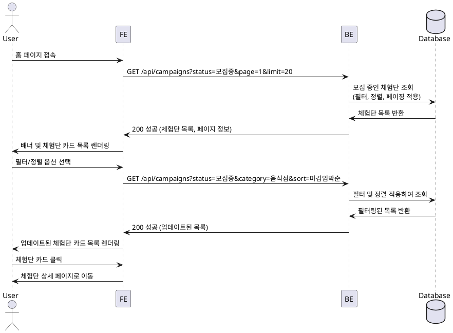

# 004 - 홈 & 체험단 목록 탐색

## Primary Actor

- 모든 사용자 (인플루언서, 광고주, 비로그인 사용자 포함)

## Precondition

- 사용자가 서비스 홈 페이지에 접근할 수 있다.

## Trigger

- 사용자가 서비스 홈 페이지에 접속하거나, 메뉴에서 "체험단 목록"을 선택한다.

## Main Scenario

1. 사용자가 홈 페이지에 접속한다.
2. 시스템은 배너 영역을 표시한다 (선택적).
3. 시스템은 모집 중인 체험단 목록을 조회한다.
4. 시스템은 체험단 목록을 카드 형태로 렌더링한다 (제목, 이미지, 모집기간, 혜택 요약 등).
5. 사용자는 필터 옵션을 선택할 수 있다 (카테고리, 지역, 모집 상태 등).
6. 사용자는 정렬 옵션을 선택할 수 있다 (최신순, 마감임박순, 인기순 등).
7. 시스템은 선택된 필터 및 정렬에 따라 목록을 업데이트한다.
8. 사용자가 체험단 카드를 클릭한다.
9. 시스템은 해당 체험단의 상세 페이지로 이동한다.

## Edge Cases

- **빈 목록**: 모집 중인 체험단이 없는 경우 안내 메시지 표시.
- **페이징 처리**: 체험단이 많을 경우 페이지네이션 또는 무한 스크롤 적용.
- **로딩 실패**: DB 조회 실패 시 에러 메시지 표시 및 재시도 버튼 제공.
- **필터 조합 없음**: 특정 필터 조합으로 결과가 없는 경우 안내 메시지 표시.
- **느린 네트워크**: 로딩 중 스켈레톤 UI 또는 로딩 스피너 표시.

## Business Rules

- 모집 중인 체험단만 목록에 표시된다 (상태가 "모집중"인 것).
- 모집기간이 종료된 체험단은 자동으로 목록에서 제외된다.
- 비로그인 사용자도 목록 조회는 가능하지만, 지원은 로그인 후 가능하다.
- 정렬 기본값은 "최신순"이다.
- 각 카드는 체험단의 핵심 정보를 요약하여 표시한다 (제목, 카테고리, 지역, 마감일, 썸네일 등).

## Sequence Diagram

