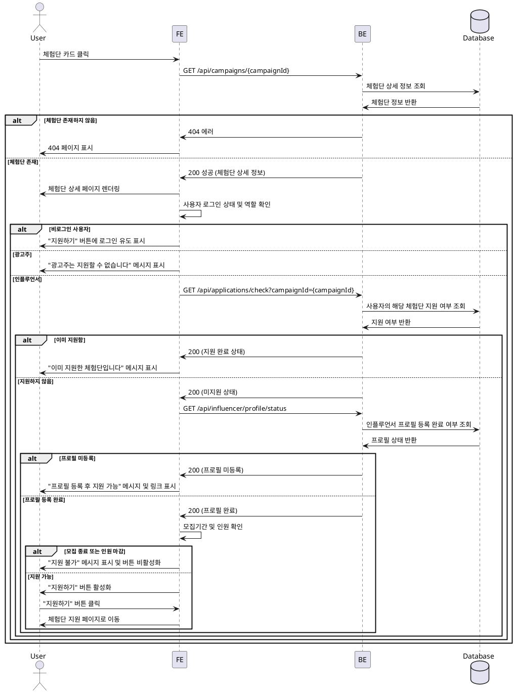

# 005 - 체험단 상세

## Primary Actor

- 모든 사용자 (인플루언서, 광고주, 비로그인 사용자 포함)

## Precondition

- 사용자가 홈 페이지에서 체험단 목록을 확인할 수 있다.
- 조회하려는 체험단이 존재한다.

## Trigger

- 사용자가 체험단 목록에서 특정 체험단 카드를 클릭한다.

## Main Scenario

1. 사용자가 체험단 카드를 클릭한다.
2. 시스템은 체험단 ID를 기반으로 상세 정보를 조회한다.
3. 시스템은 체험단 상세 정보를 표시한다 (제목, 이미지, 모집기간, 혜택, 미션, 매장 정보, 모집인원, 지원자 수 등).
4. 시스템은 사용자의 로그인 상태 및 역할을 확인한다.
5. 인플루언서이고 프로필 등록이 완료된 경우, "지원하기" 버튼을 활성화한다.
6. 그 외의 경우 (비로그인, 광고주, 프로필 미등록), 적절한 가드 메시지와 함께 버튼을 비활성화하거나 로그인 유도 버튼을 표시한다.
7. 사용자가 "지원하기" 버튼을 클릭하면 지원 페이지로 이동한다.

## Edge Cases

- **비로그인 사용자**: "지원하기" 버튼 클릭 시 로그인 페이지로 리디렉션.
- **광고주**: 지원 불가 안내 메시지 표시.
- **인플루언서 프로필 미등록**: "프로필 등록 완료 후 지원 가능합니다" 안내 메시지 표시 및 프로필 등록 페이지 링크 제공.
- **이미 지원한 체험단**: "이미 지원한 체험단입니다" 메시지 표시 및 "지원하기" 버튼 비활성화.
- **모집기간 종료**: "모집이 종료되었습니다" 메시지 표시 및 버튼 비활성화.
- **체험단 정보 조회 실패**: 404 에러 페이지 표시.
- **모집인원 초과**: "모집인원이 마감되었습니다" 메시지 표시.

## Business Rules

- 모든 사용자가 체험단 상세 정보를 조회할 수 있다.
- 지원은 인플루언서 역할이고 프로필 등록이 완료된 사용자만 가능하다.
- 이미 지원한 체험단에는 중복 지원이 불가능하다.
- 모집기간이 종료되었거나 모집인원이 마감된 체험단은 지원이 불가능하다.
- 체험단 상세 페이지에는 광고주가 등록한 모든 정보가 표시된다 (미션, 혜택, 주의사항 등).

## Sequence Diagram

