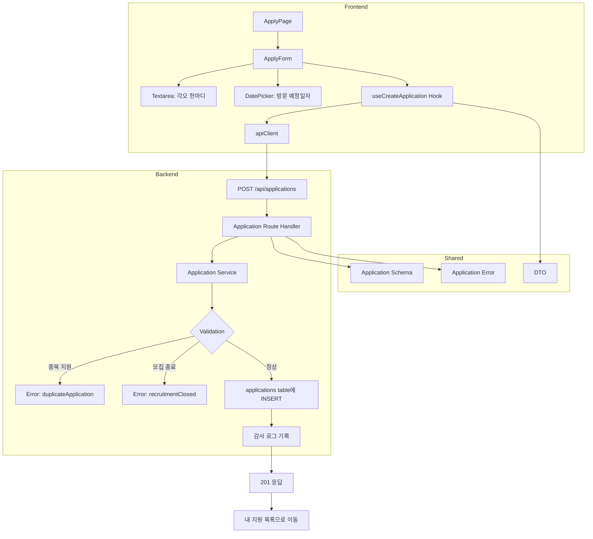

# 006 - 체험단 지원 구현 계획

## 개요

### 모듈 목록

| 모듈명 | 위치 | 설명 |
|--------|------|------|
| **Backend: Application Create Service** | `src/features/application/backend/service.ts` (확장) | 지원 생성 로직 |
| **Backend: Application Create Route** | `src/features/application/backend/route.ts` (확장) | 지원 생성 API 엔드포인트 |
| **Backend: Application Schema** | `src/features/application/backend/schema.ts` (확장) | 지원 요청/응답 스키마 |
| **Backend: Application Error** | `src/features/application/backend/error.ts` | 지원 관련 에러 코드 |
| **Frontend: Apply Page** | `src/app/application/[campaignId]/apply/page.tsx` | 체험단 지원 페이지 |
| **Frontend: Apply Form** | `src/features/application/components/apply-form.tsx` | 지원 양식 컴포넌트 |
| **Frontend: useCreateApplication** | `src/features/application/hooks/useCreateApplication.ts` | 지원 생성 mutation hook |
| **DTO Export** | `src/features/application/lib/dto.ts` (확장) | 백엔드 스키마 재노출 |
| **Shared: Date Picker** | `src/components/shared/date-picker.tsx` | 날짜 선택 컴포넌트 (shadcn-ui) |

---

## Diagram



---

## Implementation Plan

### 1. Backend Layer

#### 1.1 Schema 확장 (`src/features/application/backend/schema.ts`)

**파일 확장**
- `CreateApplicationRequestSchema`: 지원 요청
  - campaignId: UUID
  - message: string (min 10자)
  - visitDate: string (YYYY-MM-DD)
- `CreateApplicationResponseSchema`: 지원 응답
  - applicationId: UUID
  - status: 'applied'
  - createdAt: string

**Unit Tests**
- 유효한 데이터 파싱 성공
- message 최소 길이 검증
- visitDate 형식 검증
- visitDate가 체험 가능 기간 내인지 검증

#### 1.2 Error 정의 (`src/features/application/backend/error.ts`)

**파일 생성**
- `applicationErrorCodes` 객체
  - `duplicateApplication`: 중복 지원
  - `recruitmentClosed`: 모집 종료
  - `invalidVisitDate`: 유효하지 않은 방문 예정일자
  - `profileNotComplete`: 프로필 미완성
  - `databaseError`: DB 저장 실패
  - `campaignNotFound`: 체험단이 존재하지 않음

#### 1.3 Service 확장 (`src/features/application/backend/service.ts`)

**파일 확장**
- `createApplication(userId: string, data: CreateApplicationRequest)` 함수
  1. userId로 influencer_profiles 조회 (influencer_id 추출)
  2. 프로필 존재 여부 확인 (없으면 `profileNotComplete`)
  3. campaignId로 campaigns 조회
  4. 체험단 존재 여부 확인 (없으면 `campaignNotFound`)
  5. 모집 상태 확인 (recruiting이 아니면 `recruitmentClosed`)
  6. 중복 지원 확인 (campaignId + influencerId UNIQUE)
  7. visitDate가 체험 가능 기간 내인지 확인
  8. `applications` 테이블에 INSERT (상태: applied)
  9. 감사 로그 기록 (선택적)
  10. 생성된 지원 정보 반환

**Unit Tests**
- 정상 케이스: 지원 생성 성공
- 중복 지원: `duplicateApplication` 에러
- 모집 종료: `recruitmentClosed` 에러
- 프로필 없음: `profileNotComplete` 에러
- 체험단 없음: `campaignNotFound` 에러
- DB 저장 실패: `databaseError` 에러

#### 1.4 Route 확장 (`src/features/application/backend/route.ts`)

**파일 확장**
- `POST /api/applications` 엔드포인트
  1. 인증 미들웨어로 userId 추출
  2. 역할이 'influencer'인지 검증
  3. 요청 body를 `CreateApplicationRequestSchema`로 파싱
  4. `createApplication` 서비스 호출
  5. 성공: 201 응답 (applicationId, status)
  6. 실패: 적절한 HTTP 상태 코드와 에러 메시지

**Integration Tests**
- 정상 요청: 201 응답 및 지원 생성 확인
- 비인증 사용자: 401 응답
- 광고주 역할: 403 응답
- 유효성 검사 실패: 400 응답
- 중복 지원: 409 응답
- 모집 종료: 400 응답

---

### 2. Frontend Layer

#### 2.1 Date Picker Component (`src/components/shared/date-picker.tsx`)

**shadcn-ui 설치 또는 기존 컴포넌트 사용**
- Props: `value: Date | null`, `onChange: (date: Date) => void`, `minDate?: Date`, `maxDate?: Date`

**QA Sheet**
| 항목 | 기대 동작 |
|------|----------|
| 날짜 선택 | onChange 호출 |
| 범위 제한 | minDate/maxDate 밖의 날짜 선택 불가 |
| 키보드 접근성 | 키보드로 날짜 탐색 가능 |

#### 2.2 DTO Export (`src/features/application/lib/dto.ts`)

**파일 확장**
```ts
export type { CreateApplicationRequest, CreateApplicationResponse } from '../backend/schema';
export { CreateApplicationRequestSchema } from '../backend/schema';
```

#### 2.3 useCreateApplication Hook (`src/features/application/hooks/useCreateApplication.ts`)

**파일 생성**
- `useCreateApplication()` mutation hook
  - `apiClient.post('/api/applications', data)`
  - 성공 시 "내 지원 목록" 페이지로 리디렉션
  - 에러 시 toast 표시

#### 2.4 Apply Form (`src/features/application/components/apply-form.tsx`)

**파일 생성**
- Props: `campaignId: string`, `campaign: CampaignDetail`
- react-hook-form + zod resolver
- 필드:
  - message: Textarea (min 10자)
  - visitDate: DatePicker
- 클라이언트 측 유효성 검사
- `useCreateApplication` hook 호출
- 제출 버튼 로딩 상태

**QA Sheet**
| 항목 | 기대 동작 |
|------|----------|
| 각오 한마디 입력 | 10자 이상 입력 가능 |
| 10자 미만 | "10자 이상 입력해 주세요" 표시 |
| 방문 예정일자 선택 | DatePicker 동작 |
| 체험 기간 외 날짜 선택 | "체험 가능 기간 내에서 선택해 주세요" 표시 |
| 제출 성공 | 내 지원 목록으로 리디렉션 |
| 제출 실패 | 에러 메시지 toast 표시 |
| 중복 지원 | "이미 지원한 체험단입니다" 표시 |

#### 2.5 Apply Page (`src/app/application/[campaignId]/apply/page.tsx`)

**파일 생성**
- `'use client'` 지시어
- Promise를 사용하여 params 처리
- `useCampaignDetail` hook으로 체험단 정보 조회
- 가드 로직:
  - 비로그인: 로그인 페이지로 리디렉션
  - 광고주: 접근 거부
  - 인플루언서 프로필 없음: 프로필 등록 페이지로 리디렉션
  - 이미 지원함: 지원 목록 페이지로 리디렉션
  - 모집 종료: 체험단 상세 페이지로 리디렉션
- `<ApplyForm />` 렌더링

**QA Sheet**
| 항목 | 기대 동작 |
|------|----------|
| 비로그인 사용자 | 로그인 페이지로 리디렉션 |
| 광고주 | 접근 거부 메시지 |
| 프로필 미등록 | 프로필 등록 페이지로 리디렉션 |
| 이미 지원함 | 지원 목록 페이지로 리디렉션 |
| 모집 종료 | 체험단 상세 페이지로 리디렉션 |
| 정상 | 지원 양식 표시 |

---

### 3. Shared Modules

#### 3.1 Date Picker (`src/components/shared/date-picker.tsx`)

**shadcn-ui 설치**
```bash
npx shadcn@latest add calendar
npx shadcn@latest add popover
```

---

### 4. Database Migration

**이미 존재함**
- `applications` 테이블에 UNIQUE 제약 (campaign_id, influencer_id)
- 추가 마이그레이션 불필요

---

## 작업 순서

1. **Shared**: Date Picker 컴포넌트 준비 (shadcn-ui)
2. **Backend**: Schema → Error → Service → Route 순서로 작성
3. **Frontend**: DTO → Hook → Components → Page 순서로 작성
4. **E2E**: 지원 프로세스 QA (가드 로직, 유효성 검사, 제출)

---

## 주요 고려사항

- **중복 지원 방지**: DB UNIQUE 제약 + 백엔드 검증
- **체험 기간 검증**: 클라이언트와 서버 양쪽에서 검증
- **감사 로그**: 지원 이력 추적을 위해 로그 기록 (선택적)
- **트랜잭션**: 지원 생성 및 로그 기록은 트랜잭션으로 처리
- **에러 처리**: 각 에러 케이스에 대해 명확한 메시지 제공