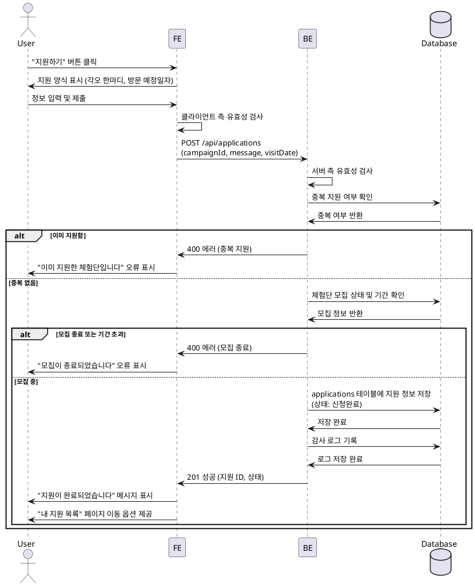

# 006 - 체험단 지원

## Primary Actor

- 인플루언서 역할의 사용자 (프로필 등록 완료)

## Precondition

- 사용자가 로그인되어 있고 인플루언서 역할이다.
- 인플루언서 프로필 등록이 완료되어 있다.
- 체험단 상세 페이지에서 "지원하기" 버튼을 통해 접근한다.
- 해당 체험단이 모집 중이며 아직 지원하지 않았다.

## Trigger

- 사용자가 체험단 상세 페이지에서 "지원하기" 버튼을 클릭한다.

## Main Scenario

1. 사용자가 "지원하기" 버튼을 클릭한다.
2. 시스템은 지원 양식 페이지 또는 다이얼로그를 표시한다 (각오 한마디, 방문 예정일자).
3. 사용자가 각오 한마디를 입력한다.
4. 사용자가 방문 예정일자를 선택한다.
5. 사용자가 "제출" 버튼을 클릭한다.
6. 시스템은 입력된 정보의 유효성을 검사한다 (필수 필드, 날짜 형식, 방문 가능 기간 등).
7. 시스템은 중복 지원 여부를 확인한다.
8. 시스템은 모집기간 내 지원인지 확인한다.
9. 시스템은 `applications` 테이블에 지원 정보를 저장한다 (상태: 신청완료).
10. 시스템은 감사 로그를 기록한다.
11. 시스템은 제출 완료 메시지를 표시하고, "내 지원 목록" 페이지로 이동 옵션을 제공한다.

## Edge Cases

- **중복 지원**: 이미 지원한 체험단인 경우 오류 메시지 표시 및 지원 차단.
- **모집기간 종료**: 모집기간이 종료된 경우 오류 메시지 표시 및 지원 차단.
- **유효성 검사 실패**: 각오 한마디가 너무 짧거나 방문 예정일자가 체험 가능 기간을 벗어난 경우 필드별 오류 표시.
- **프로필 미완성**: 지원 시점에 프로필이 불완전한 경우 (채널 검증 실패 등) 경고 메시지 표시 및 프로필 수정 유도.
- **DB 저장 실패**: 네트워크 또는 서버 오류 시 재시도 옵션 제공.
- **모집인원 초과**: 동시 지원으로 인해 모집인원이 초과된 경우 오류 메시지 표시.

## Business Rules

- 지원은 인플루언서 역할이고 프로필 등록이 완료된 사용자만 가능하다.
- 한 체험단에는 1회만 지원할 수 있다.
- 모집기간 내에만 지원이 가능하다.
- 각오 한마디는 최소 10자 이상 작성해야 한다 (정책에 따라 조정 가능).
- 방문 예정일자는 체험단의 체험 가능 기간 내에 있어야 한다.
- 지원 완료 후 상태는 "신청완료"로 설정되며, 광고주의 선정 결과에 따라 "선정" 또는 "반려"로 변경된다.

## Sequence Diagram

