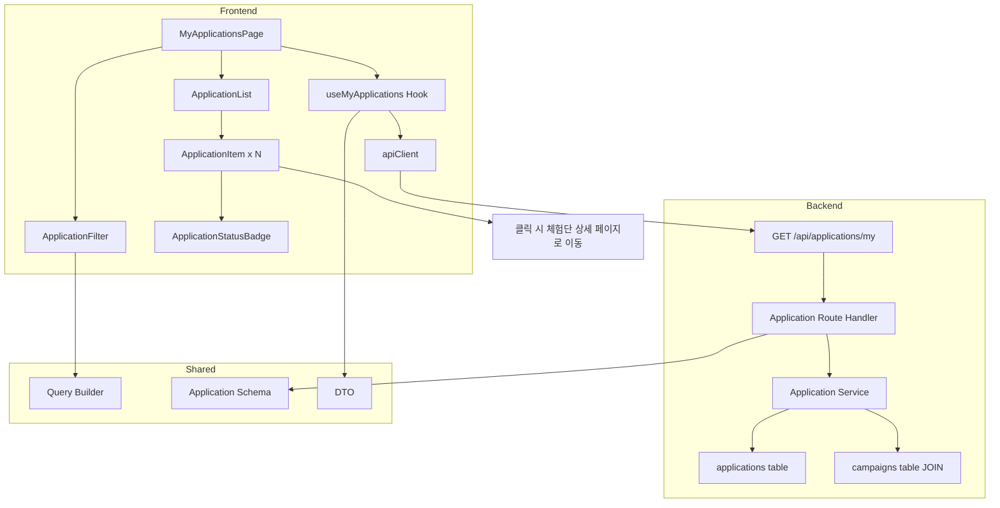

# 007 - 내 지원 목록 (인플루언서 전용) 구현 계획

## 개요

### 모듈 목록

| 모듈명 | 위치 | 설명 |
|--------|------|------|
| **Backend: My Applications Service** | `src/features/application/backend/service.ts` (확장) | 내 지원 목록 조회 로직 |
| **Backend: My Applications Route** | `src/features/application/backend/route.ts` (확장) | 내 지원 목록 API 엔드포인트 |
| **Backend: My Applications Schema** | `src/features/application/backend/schema.ts` (확장) | 목록 조회 요청/응답 스키마 |
| **Frontend: My Applications Page** | `src/app/my-applications/page.tsx` | 내 지원 목록 페이지 |
| **Frontend: Application List** | `src/features/application/components/application-list.tsx` | 지원 목록 컴포넌트 |
| **Frontend: Application Item** | `src/features/application/components/application-item.tsx` | 개별 지원 항목 컴포넌트 |
| **Frontend: Application Status Badge** | `src/features/application/components/application-status-badge.tsx` | 지원 상태 배지 컴포넌트 |
| **Frontend: Application Filter** | `src/features/application/components/application-filter.tsx` | 상태 필터 컴포넌트 |
| **Frontend: useMyApplications** | `src/features/application/hooks/useMyApplications.ts` | 내 지원 목록 조회 hook |
| **DTO Export** | `src/features/application/lib/dto.ts` (확장) | 백엔드 스키마 재노출 |

---

## Diagram



---

## Implementation Plan

### 1. Backend Layer

#### 1.1 Schema 확장 (`src/features/application/backend/schema.ts`)

**파일 확장**
- `MyApplicationsQuerySchema`: 목록 조회 쿼리 파라미터
  - status?: 'all' | 'applied' | 'selected' | 'rejected' (기본값: all)
  - page?: number (기본값: 1)
  - limit?: number (기본값: 20)
- `ApplicationItemSchema`: 개별 지원 항목
  - id: UUID (application id)
  - campaignId: UUID
  - campaignTitle: string
  - campaignImage?: string
  - message: string
  - visitDate: string
  - status: 'applied' | 'selected' | 'rejected'
  - createdAt: string
- `MyApplicationsResponseSchema`: 목록 조회 응답
  - applications: ApplicationItemSchema[]
  - pagination: { page: number, limit: number, total: number }

**Unit Tests**
- 쿼리 파라미터 기본값 적용
- status enum 검증

#### 1.2 Service 확장 (`src/features/application/backend/service.ts`)

**파일 확장**
- `getMyApplications(userId: string, query: MyApplicationsQuery)` 함수
  1. userId로 influencer_profiles에서 influencer_id 조회
  2. `applications` 테이블에서 influencer_id로 조회
  3. `campaigns` 테이블 JOIN (제목, 이미지 등)
  4. status 필터 적용 (all이 아닌 경우)
  5. 정렬: created_at DESC
  6. 페이지네이션 적용
  7. 총 개수 조회
  8. 결과 반환

**Unit Tests**
- 정상 케이스: 목록 조회 성공
- status 필터 적용: 특정 상태만 조회
- 페이지네이션: offset/limit 적용 확인
- DB 조회 실패: `fetchError` 에러

#### 1.3 Route 확장 (`src/features/application/backend/route.ts`)

**파일 확장**
- `GET /api/applications/my` 엔드포인트
  1. 인증 미들웨어로 userId 추출
  2. 역할이 'influencer'인지 검증
  3. 쿼리 파라미터를 `MyApplicationsQuerySchema`로 파싱
  4. `getMyApplications` 서비스 호출
  5. 성공: 200 응답 (applications, pagination)
  6. 실패: 적절한 HTTP 상태 코드와 에러 메시지

**Integration Tests**
- 정상 요청: 200 응답 및 목록 반환
- 비인증 사용자: 401 응답
- 광고주 역할: 403 응답
- status 필터: 특정 상태만 조회 확인

---

### 2. Frontend Layer

#### 2.1 DTO Export (`src/features/application/lib/dto.ts`)

**파일 확장**
```ts
export type { MyApplicationsQuery, ApplicationItem, MyApplicationsResponse } from '../backend/schema';
export { MyApplicationsQuerySchema } from '../backend/schema';
```

#### 2.2 useMyApplications Hook (`src/features/application/hooks/useMyApplications.ts`)

**파일 생성**
- `useMyApplications(query: MyApplicationsQuery)` React Query hook
  - `apiClient.get('/api/applications/my', { params: query })`
  - 자동 리페칭 및 캐싱
  - staleTime 설정

#### 2.3 Application Status Badge (`src/features/application/components/application-status-badge.tsx`)

**파일 생성**
- Props: `status: 'applied' | 'selected' | 'rejected'`
- shadcn-ui Badge 사용
- 상태별 색상 및 텍스트:
  - applied: "신청완료" (파란색)
  - selected: "선정" (초록색)
  - rejected: "반려" (회색)

**QA Sheet**
| 항목 | 기대 동작 |
|------|----------|
| applied | "신청완료" 파란색 배지 |
| selected | "선정" 초록색 배지 |
| rejected | "반려" 회색 배지 |

#### 2.4 Application Item (`src/features/application/components/application-item.tsx`)

**파일 생성**
- Props: `application: ApplicationItem`
- shadcn-ui Card 사용
- 표시 정보:
  - 체험단 제목 및 이미지
  - 각오 한마디 (요약)
  - 방문 예정일자
  - 지원일자
  - 상태 배지
- 클릭 시 체험단 상세 페이지로 이동

**QA Sheet**
| 항목 | 기대 동작 |
|------|----------|
| 카드 클릭 | 체험단 상세 페이지로 이동 |
| 상태 배지 | 상태에 맞는 배지 표시 |
| 이미지 없음 | placeholder 이미지 표시 |

#### 2.5 Application Filter (`src/features/application/components/application-filter.tsx`)

**파일 생성**
- Props: `value: 'all' | 'applied' | 'selected' | 'rejected'`, `onChange: (status) => void`
- Tabs 또는 RadioGroup 사용
- 옵션: "전체", "신청완료", "선정", "반려"

**QA Sheet**
| 항목 | 기대 동작 |
|------|----------|
| 필터 선택 | onChange 호출 및 목록 갱신 |
| "전체" 선택 | 모든 상태 표시 |

#### 2.6 Application List (`src/features/application/components/application-list.tsx`)

**파일 생성**
- Props: `applications: ApplicationItem[]`, `isLoading: boolean`, `error?: Error`
- 로딩 중: 스켈레톤 UI
- 에러: 에러 메시지 및 재시도 버튼
- 빈 목록: "아직 지원한 체험단이 없습니다" 메시지 + 홈으로 이동 버튼
- 정상: `ApplicationItem` 배열 렌더링

**QA Sheet**
| 항목 | 기대 동작 |
|------|----------|
| 로딩 중 | 스켈레톤 UI 표시 |
| 에러 발생 | 에러 메시지 및 재시도 버튼 |
| 빈 목록 | 안내 메시지 및 홈 버튼 |
| 정상 목록 | 지원 항목 카드 렌더링 |

#### 2.7 My Applications Page (`src/app/my-applications/page.tsx`)

**파일 생성**
- `'use client'` 지시어
- `useState`로 필터 상태 관리
- `useMyApplications` hook 호출
- 가드 로직:
  - 비로그인: 로그인 페이지로 리디렉션
  - 광고주: 접근 거부 메시지
- `<ApplicationFilter />`, `<ApplicationList />`, `<Pagination />` 렌더링

**QA Sheet**
| 항목 | 기대 동작 |
|------|----------|
| 페이지 로드 | 내 지원 목록 표시 |
| 비로그인 사용자 | 로그인 페이지로 리디렉션 |
| 광고주 | "인플루언서만 접근 가능합니다" 메시지 |
| 필터 변경 | 목록 갱신 |
| 페이지 변경 | 목록 갱신 |
| 모바일 반응형 | 작은 화면에서도 레이아웃 유지 |

---

### 3. Shared Modules

**변경 없음**

---

### 4. Database Migration

**이미 존재함**
- 추가 마이그레이션 불필요

---

## 작업 순서

1. **Backend**: Schema → Service → Route 순서로 작성
2. **Frontend**: DTO → Hook → Components → Page 순서로 작성
3. **E2E**: 필터링, 페이지네이션 QA

---

## 주요 고려사항

- **권한 확인**: 인플루언서 역할만 접근 가능
- **캐싱**: React Query로 자동 캐싱 및 리페칭
- **성능**: JOIN 쿼리 최적화, 인덱스 활용
- **빈 목록**: 신규 사용자를 위한 안내 메시지 및 홈 버튼
- **상태 알림**: 새로운 선정/반려 결과가 있을 경우 배지 또는 알림 표시 (선택적)