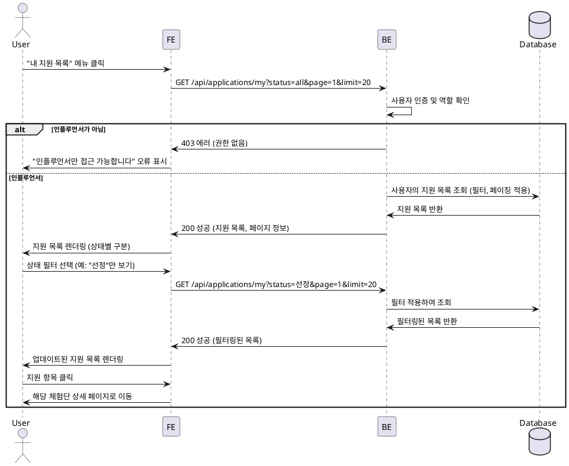

# 007 - 내 지원 목록 (인플루언서 전용)

## Primary Actor

- 인플루언서 역할의 사용자

## Precondition

- 사용자가 로그인되어 있고 인플루언서 역할이다.
- 사용자가 최소 1개 이상의 체험단에 지원한 적이 있다 (선택적).

## Trigger

- 사용자가 메뉴에서 "내 지원 목록"을 클릭하거나, 체험단 지원 완료 후 "내 지원 목록으로 이동" 버튼을 클릭한다.

## Main Scenario

1. 사용자가 "내 지원 목록" 페이지에 접근한다.
2. 시스템은 사용자의 모든 지원 내역을 조회한다.
3. 시스템은 지원 목록을 상태별로 표시한다 (신청완료, 선정, 반려).
4. 사용자는 상태 필터를 선택하여 특정 상태의 지원 목록만 볼 수 있다.
5. 각 지원 항목은 체험단명, 지원일자, 상태, 각오 한마디, 방문 예정일자 등을 표시한다.
6. 사용자는 지원 항목을 클릭하여 해당 체험단의 상세 페이지로 이동할 수 있다.

## Edge Cases

- **빈 목록**: 지원한 체험단이 없는 경우 "아직 지원한 체험단이 없습니다" 안내 메시지 및 홈으로 이동 버튼 표시.
- **필터 결과 없음**: 특정 상태로 필터링했을 때 결과가 없는 경우 안내 메시지 표시.
- **DB 조회 실패**: 네트워크 또는 서버 오류 시 에러 메시지 및 재시도 버튼 표시.
- **페이징 처리**: 지원 목록이 많을 경우 페이지네이션 또는 무한 스크롤 적용.
- **선정 결과 알림**: 새로운 선정/반려 결과가 있을 경우 배지 또는 알림 표시.

## Business Rules

- "내 지원 목록"은 인플루언서 역할의 사용자만 접근할 수 있다.
- 지원 목록은 본인이 지원한 체험단만 표시된다.
- 지원 상태는 "신청완료", "선정", "반려" 세 가지로 구분된다.
- 기본 정렬은 지원일자 기준 최신순이다.
- 각 지원 항목에는 체험단의 핵심 정보(제목, 이미지 등)와 지원 정보(각오 한마디, 방문 예정일자, 상태)가 함께 표시된다.

## Sequence Diagram

