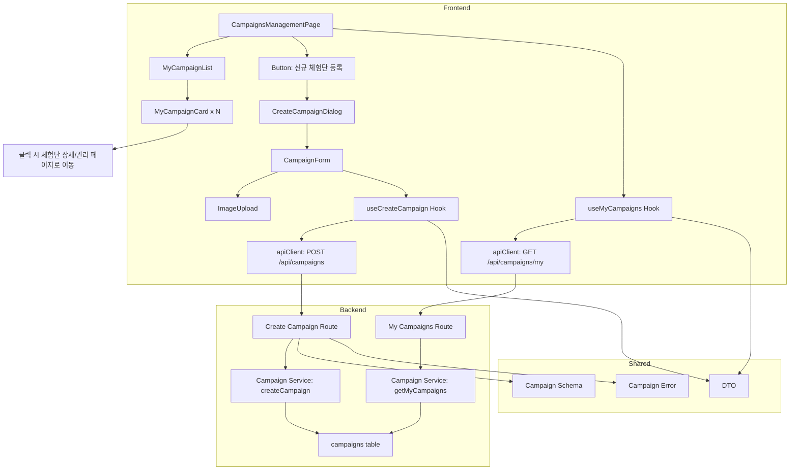

# 008 - 광고주 체험단 관리 구현 계획

## 개요

### 모듈 목록

| 모듈명 | 위치 | 설명 |
|--------|------|------|
| **Backend: My Campaigns Service** | `src/features/campaign/backend/service.ts` (확장) | 내 체험단 목록 조회 로직 |
| **Backend: My Campaigns Route** | `src/features/campaign/backend/route.ts` (확장) | 내 체험단 목록 API 엔드포인트 |
| **Backend: Create Campaign Service** | `src/features/campaign/backend/service.ts` (확장) | 체험단 등록 로직 |
| **Backend: Create Campaign Route** | `src/features/campaign/backend/route.ts` (확장) | 체험단 등록 API 엔드포인트 |
| **Backend: Campaign Schema** | `src/features/campaign/backend/schema.ts` (확장) | 등록/조회 요청/응답 스키마 |
| **Backend: Campaign Error** | `src/features/campaign/backend/error.ts` (확장) | 체험단 관리 관련 에러 코드 |
| **Frontend: Campaigns Management Page** | `src/app/advertiser/campaigns/page.tsx` | 체험단 관리 페이지 |
| **Frontend: My Campaign List** | `src/features/campaign/components/my-campaign-list.tsx` | 내 체험단 목록 컴포넌트 |
| **Frontend: My Campaign Card** | `src/features/campaign/components/my-campaign-card.tsx` | 내 체험단 카드 컴포넌트 |
| **Frontend: Create Campaign Dialog** | `src/features/campaign/components/create-campaign-dialog.tsx` | 체험단 등록 다이얼로그 |
| **Frontend: Campaign Form** | `src/features/campaign/components/campaign-form.tsx` | 체험단 정보 입력 폼 |
| **Frontend: useMyCampaigns** | `src/features/campaign/hooks/useMyCampaigns.ts` | 내 체험단 목록 조회 hook |
| **Frontend: useCreateCampaign** | `src/features/campaign/hooks/useCreateCampaign.ts` | 체험단 등록 mutation hook |
| **DTO Export** | `src/features/campaign/lib/dto.ts` (확장) | 백엔드 스키마 재노출 |
| **Shared: Image Upload** | `src/components/shared/image-upload.tsx` | 이미지 업로드 컴포넌트 |

---

## Diagram



---

## Implementation Plan

### 1. Backend Layer

#### 1.1 Schema 확장 (`src/features/campaign/backend/schema.ts`)

**파일 확장**
- `MyCampaignsQuerySchema`: 내 체험단 목록 조회 쿼리
  - page?: number (기본값: 1)
  - limit?: number (기본값: 20)
- `MyCampaignItemSchema`: 내 체험단 항목
  - id: UUID
  - title: string
  - status: 'recruiting' | 'closed' | 'selection_complete'
  - recruitmentCount: number
  - applicationCount: number
  - recruitmentStartDate: string
  - recruitmentEndDate: string
  - createdAt: string
- `MyCampaignsResponseSchema`: 내 체험단 목록 응답
  - campaigns: MyCampaignItemSchema[]
  - pagination: { page: number, limit: number, total: number }
- `CreateCampaignRequestSchema`: 체험단 등록 요청
  - title: string (min 1자)
  - recruitmentStartDate: string (YYYY-MM-DD)
  - recruitmentEndDate: string (YYYY-MM-DD)
  - recruitmentCount: number (min 1)
  - benefits: string
  - storeInfo: string
  - mission: string
  - category: string
  - location: string
  - images?: string[] (선택적)
- `CreateCampaignResponseSchema`: 체험단 등록 응답
  - campaignId: UUID
  - status: 'recruiting'

**Unit Tests**
- 날짜 검증: recruitmentEndDate >= recruitmentStartDate
- 모집인원 검증: recruitmentCount > 0
- 필수 필드 검증

#### 1.2 Error 확장 (`src/features/campaign/backend/error.ts`)

**파일 확장**
- `campaignErrorCodes` 객체 확장
  - `profileNotVerified`: 광고주 프로필 미검증
  - `invalidDateRange`: 유효하지 않은 날짜 범위
  - `createError`: 체험단 생성 실패

#### 1.3 Service 확장 (`src/features/campaign/backend/service.ts`)

**파일 확장**
- `getMyCampaigns(advertiserId: string, query: MyCampaignsQuery)` 함수
  1. `campaigns` 테이블에서 advertiser_id로 조회
  2. 각 체험단의 지원자 수 계산 (JOIN applications)
  3. 정렬: created_at DESC
  4. 페이지네이션 적용
  5. 총 개수 조회
  6. 결과 반환

- `createCampaign(userId: string, data: CreateCampaignRequest)` 함수
  1. userId로 advertiser_profiles에서 advertiser_id 조회
  2. 프로필 검증 상태 확인 (verified가 아니면 `profileNotVerified`)
  3. 날짜 검증 (recruitmentEndDate >= recruitmentStartDate)
  4. `campaigns` 테이블에 INSERT (상태: recruiting)
  5. 생성된 체험단 정보 반환

**Unit Tests**
- getMyCampaigns: 목록 조회 성공
- createCampaign: 체험단 생성 성공
- createCampaign: 프로필 미검증 시 에러
- createCampaign: 날짜 범위 오류 시 에러

#### 1.4 Route 확장 (`src/features/campaign/backend/route.ts`)

**파일 확장**
- `GET /api/campaigns/my` 엔드포인트
  1. 인증 미들웨어로 userId 추출
  2. 역할이 'advertiser'인지 검증
  3. userId로 advertiser_id 조회
  4. 쿼리 파라미터 파싱
  5. `getMyCampaigns` 서비스 호출
  6. 성공: 200 응답

- `POST /api/campaigns` 엔드포인트
  1. 인증 미들웨어로 userId 추출
  2. 역할이 'advertiser'인지 검증
  3. 요청 body를 `CreateCampaignRequestSchema`로 파싱
  4. `createCampaign` 서비스 호출
  5. 성공: 201 응답
  6. 실패: 적절한 HTTP 상태 코드와 에러 메시지

**Integration Tests**
- GET /api/campaigns/my: 정상 요청 200 응답
- GET /api/campaigns/my: 비인증 사용자 401 응답
- GET /api/campaigns/my: 인플루언서 역할 403 응답
- POST /api/campaigns: 정상 요청 201 응답
- POST /api/campaigns: 유효성 검사 실패 400 응답
- POST /api/campaigns: 프로필 미검증 403 응답

---

### 2. Frontend Layer

#### 2.1 Image Upload Component (`src/components/shared/image-upload.tsx`)

**파일 생성 (선택적)**
- Props: `value: string[]`, `onChange: (urls: string[]) => void`, `maxFiles?: number`
- shadcn-ui FileUpload 사용
- 이미지 업로드 API 연동 (Supabase Storage 또는 외부 서비스)
- 초기에는 URL 직접 입력으로 대체 가능

**QA Sheet**
| 항목 | 기대 동작 |
|------|----------|
| 파일 선택 | 이미지 미리보기 표시 |
| 업로드 | 서버에 업로드 후 URL 반환 |
| 삭제 | 이미지 제거 |
| 최대 파일 수 제한 | maxFiles 초과 시 경고 |

#### 2.2 DTO Export (`src/features/campaign/lib/dto.ts`)

**파일 확장**
```ts
export type { MyCampaignsQuery, MyCampaignItem, MyCampaignsResponse, CreateCampaignRequest, CreateCampaignResponse } from '../backend/schema';
export { CreateCampaignRequestSchema } from '../backend/schema';
```

#### 2.3 useMyCampaigns Hook (`src/features/campaign/hooks/useMyCampaigns.ts`)

**파일 생성**
- `useMyCampaigns(query: MyCampaignsQuery)` React Query hook
  - `apiClient.get('/api/campaigns/my', { params: query })`
  - 자동 리페칭 및 캐싱

#### 2.4 useCreateCampaign Hook (`src/features/campaign/hooks/useCreateCampaign.ts`)

**파일 생성**
- `useCreateCampaign()` mutation hook
  - `apiClient.post('/api/campaigns', data)`
  - 성공 시 목록 갱신 (invalidateQueries)
  - 성공 toast 표시

#### 2.5 My Campaign Card (`src/features/campaign/components/my-campaign-card.tsx`)

**파일 생성**
- Props: `campaign: MyCampaignItem`
- shadcn-ui Card 사용
- 표시 정보:
  - 제목, 상태 배지
  - 모집기간, 모집인원/지원자 수
  - 등록일자
- 클릭 시 체험단 상세/관리 페이지로 이동 (`/advertiser/campaigns/${id}`)

**QA Sheet**
| 항목 | 기대 동작 |
|------|----------|
| 카드 클릭 | 체험단 관리 페이지로 이동 |
| 상태 배지 | 모집중/모집종료/선정완료 표시 |

#### 2.6 My Campaign List (`src/features/campaign/components/my-campaign-list.tsx`)

**파일 생성**
- Props: `campaigns: MyCampaignItem[]`, `isLoading: boolean`, `error?: Error`
- 로딩 중: 스켈레톤 UI
- 에러: 에러 메시지 및 재시도 버튼
- 빈 목록: "아직 등록한 체험단이 없습니다" 메시지 + 신규 등록 유도
- 정상: `MyCampaignCard` 배열 렌더링

**QA Sheet**
| 항목 | 기대 동작 |
|------|----------|
| 로딩 중 | 스켈레톤 UI 표시 |
| 에러 발생 | 에러 메시지 및 재시도 버튼 |
| 빈 목록 | 안내 메시지 및 등록 유도 |
| 정상 목록 | 체험단 카드 렌더링 |

#### 2.7 Campaign Form (`src/features/campaign/components/campaign-form.tsx`)

**파일 생성**
- react-hook-form + zod resolver
- 필드:
  - title, category, location
  - recruitmentStartDate, recruitmentEndDate (DatePicker)
  - recruitmentCount (Input type="number")
  - benefits, storeInfo, mission (Textarea)
  - images (ImageUpload 또는 Input, 선택적)
- 클라이언트 측 유효성 검사
- `useCreateCampaign` hook 호출
- 제출 버튼 로딩 상태

**QA Sheet**
| 항목 | 기대 동작 |
|------|----------|
| 모든 필드 입력 | 제출 버튼 활성화 |
| 날짜 범위 오류 | "종료일은 시작일 이후여야 합니다" 표시 |
| 모집인원 0 이하 | "모집인원은 1명 이상이어야 합니다" 표시 |
| 제출 성공 | 다이얼로그 닫힘 및 목록 갱신 |
| 제출 실패 | 에러 메시지 toast 표시 |

#### 2.8 Create Campaign Dialog (`src/features/campaign/components/create-campaign-dialog.tsx`)

**파일 생성**
- Props: `open: boolean`, `onOpenChange: (open: boolean) => void`
- shadcn-ui Dialog 사용
- `<CampaignForm />` 렌더링

**QA Sheet**
| 항목 | 기대 동작 |
|------|----------|
| 다이얼로그 열림 | 폼 표시 |
| 제출 성공 | 다이얼로그 닫힘 |
| 취소 버튼 | 다이얼로그 닫힘 |

#### 2.9 Campaigns Management Page (`src/app/advertiser/campaigns/page.tsx`)

**파일 생성**
- `'use client'` 지시어
- `useState`로 다이얼로그 상태 관리
- `useMyCampaigns` hook 호출
- 가드 로직:
  - 비로그인: 로그인 페이지로 리디렉션
  - 인플루언서: 접근 거부 메시지
  - 프로필 미검증: 프로필 등록 페이지로 리디렉션
- "신규 체험단 등록" 버튼
- `<CreateCampaignDialog />`, `<MyCampaignList />`, `<Pagination />` 렌더링

**QA Sheet**
| 항목 | 기대 동작 |
|------|----------|
| 페이지 로드 | 내 체험단 목록 표시 |
| 비로그인 사용자 | 로그인 페이지로 리디렉션 |
| 인플루언서 | "광고주만 접근 가능합니다" 메시지 |
| 프로필 미검증 | 프로필 등록 페이지로 리디렉션 |
| 신규 등록 버튼 클릭 | 다이얼로그 열림 |
| 등록 완료 | 목록 갱신 |
| 모바일 반응형 | 작은 화면에서도 레이아웃 유지 |

---

### 3. Shared Modules

#### 3.1 Image Upload (`src/components/shared/image-upload.tsx`)

**새 파일 생성 (선택적)**
- 초기에는 URL 직접 입력으로 대체 가능

---

### 4. Database Migration

**이미 존재함**
- 추가 마이그레이션 불필요

---

## 작업 순서

1. **Backend**: Schema → Service → Route 순서로 작성
2. **Frontend**: Shared (ImageUpload) → DTO → Hooks → Components → Page 순서로 작성
3. **E2E**: 체험단 등록 및 목록 조회 QA

---

## 주요 고려사항

- **권한 확인**: 광고주 역할만 접근 가능
- **프로필 검증**: 프로필이 verified 상태일 때만 체험단 등록 가능
- **이미지 업로드**: 초기에는 URL 직접 입력, 추후 Supabase Storage 연동
- **날짜 검증**: 클라이언트와 서버 양쪽에서 검증
- **빈 목록**: 신규 광고주를 위한 안내 메시지 및 등록 유도