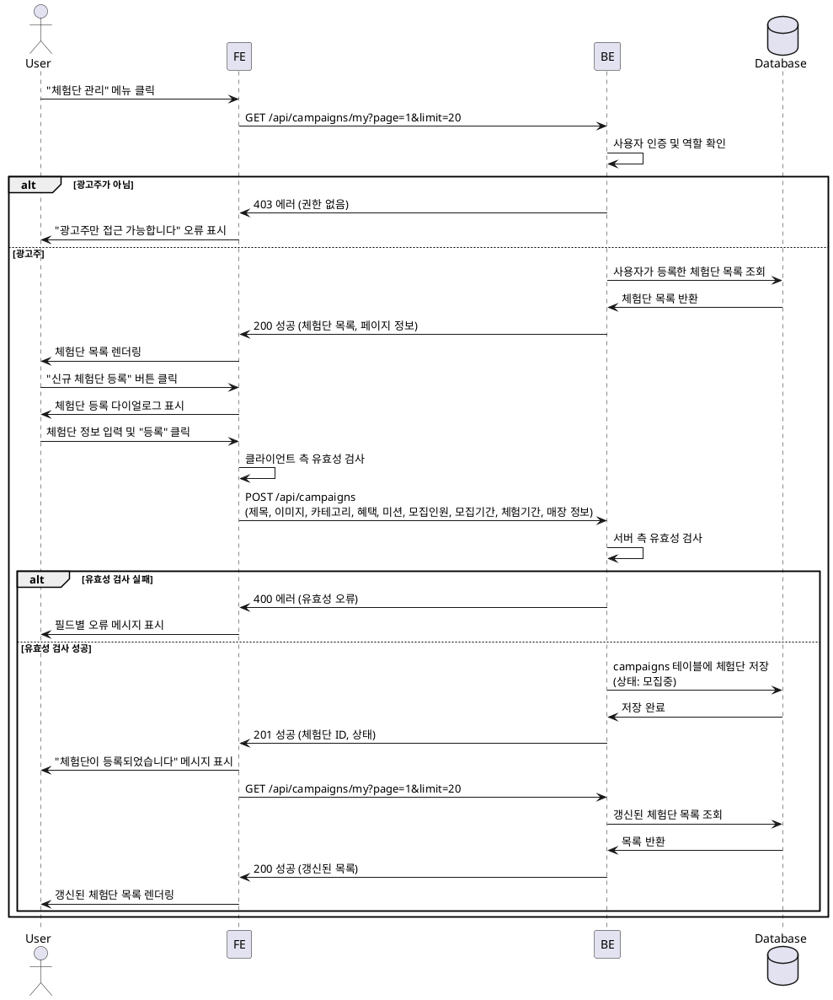

# 008 - 광고주 체험단 관리

## Primary Actor

- 광고주 역할의 사용자 (프로필 등록 완료)

## Precondition

- 사용자가 로그인되어 있고 광고주 역할이다.
- 광고주 프로필 등록이 완료되어 있다.

## Trigger

- 사용자가 메뉴에서 "체험단 관리"를 클릭한다.

## Main Scenario

1. 사용자가 "체험단 관리" 페이지에 접근한다.
2. 시스템은 사용자가 등록한 체험단 목록을 조회한다.
3. 시스템은 체험단 목록을 상태별로 표시한다 (모집중, 모집종료, 선정완료).
4. 사용자는 "신규 체험단 등록" 버튼을 클릭한다.
5. 시스템은 체험단 등록 다이얼로그(또는 페이지)를 표시한다.
6. 사용자가 체험단 정보를 입력한다 (제목, 이미지, 카테고리, 혜택, 미션, 모집인원, 모집기간, 체험기간, 매장 정보 등).
7. 사용자가 "등록" 버튼을 클릭한다.
8. 시스템은 입력된 정보의 유효성을 검사한다.
9. 시스템은 `campaigns` 테이블에 체험단을 저장한다 (상태: 모집중).
10. 시스템은 등록 완료 메시지를 표시하고, 체험단 목록을 갱신한다.
11. 사용자는 등록한 체험단을 목록에서 확인할 수 있다.

## Edge Cases

- **프로필 미완성**: 광고주 프로필이 검증되지 않은 경우 체험단 등록 차단 및 안내 메시지 표시.
- **유효성 검사 실패**: 필수 필드 누락, 날짜 형식 오류, 모집인원 범위 초과 등의 경우 필드별 오류 표시.
- **이미지 업로드 실패**: 이미지 업로드 중 오류 발생 시 재시도 옵션 제공.
- **DB 저장 실패**: 네트워크 또는 서버 오류 시 재시도 옵션 제공.
- **빈 목록**: 등록한 체험단이 없는 경우 "아직 등록한 체험단이 없습니다" 안내 메시지 및 신규 등록 유도.
- **페이징 처리**: 체험단이 많을 경우 페이지네이션 적용.

## Business Rules

- "체험단 관리"는 광고주 역할의 사용자만 접근할 수 있다.
- 광고주는 자신이 등록한 체험단만 관리할 수 있다.
- 체험단 등록 시 모집기간과 체험기간은 논리적으로 유효해야 한다 (모집 종료일이 체험 시작일보다 빠름 등).
- 신규 등록된 체험단의 기본 상태는 "모집중"이다.
- 체험단 목록은 등록일자 기준 최신순으로 정렬된다.
- 각 체험단 카드에는 상태, 제목, 모집인원, 지원자 수, 모집기간 등이 표시된다.

## Sequence Diagram

