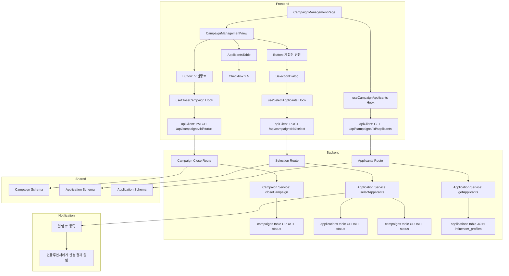

# 009 - 광고주 체험단 상세 & 모집 관리 구현 계획

## 개요

### 모듈 목록

| 모듈명 | 위치 | 설명 |
|--------|------|------|
| **Backend: Campaign Management Service** | `src/features/campaign/backend/service.ts` (확장) | 체험단 관리 로직 (모집종료, 선정) |
| **Backend: Campaign Management Route** | `src/features/campaign/backend/route.ts` (확장) | 체험단 관리 API 엔드포인트 |
| **Backend: Applicants Service** | `src/features/application/backend/service.ts` (확장) | 지원자 목록 조회 로직 |
| **Backend: Applicants Route** | `src/features/application/backend/route.ts` (확장) | 지원자 목록 API 엔드포인트 |
| **Backend: Selection Service** | `src/features/application/backend/service.ts` (확장) | 지원자 선정 로직 |
| **Backend: Selection Route** | `src/features/application/backend/route.ts` (확장) | 지원자 선정 API 엔드포인트 |
| **Backend: Schema** | `src/features/campaign/backend/schema.ts`, `src/features/application/backend/schema.ts` (확장) | 관리 관련 스키마 |
| **Frontend: Campaign Management Page** | `src/app/advertiser/campaigns/[id]/page.tsx` | 체험단 관리 상세 페이지 |
| **Frontend: Campaign Management View** | `src/features/campaign/components/campaign-management-view.tsx` | 체험단 정보 및 관리 UI |
| **Frontend: Applicants Table** | `src/features/application/components/applicants-table.tsx` | 지원자 목록 테이블 |
| **Frontend: Selection Dialog** | `src/features/application/components/selection-dialog.tsx` | 지원자 선정 다이얼로그 |
| **Frontend: useCampaignApplicants** | `src/features/application/hooks/useCampaignApplicants.ts` | 지원자 목록 조회 hook |
| **Frontend: useCloseCampaign** | `src/features/campaign/hooks/useCloseCampaign.ts` | 모집종료 mutation hook |
| **Frontend: useSelectApplicants** | `src/features/application/hooks/useSelectApplicants.ts` | 지원자 선정 mutation hook |
| **DTO Export** | `src/features/campaign/lib/dto.ts`, `src/features/application/lib/dto.ts` (확장) | 백엔드 스키마 재노출 |

---

## Diagram



---

## Implementation Plan

### 1. Backend Layer

#### 1.1 Schema 확장

**`src/features/campaign/backend/schema.ts` 확장**
- `CloseCampaignRequestSchema`: 모집종료 요청
  - (body 없음, 경로 파라미터만)
- `CloseCampaignResponseSchema`: 모집종료 응답
  - campaignId: UUID
  - status: 'closed'

**`src/features/application/backend/schema.ts` 확장**
- `ApplicantSchema`: 지원자 정보
  - applicationId: UUID
  - influencerId: UUID
  - influencerName: string
  - influencerChannels: { platform: string, channelName: string, channelUrl: string }[]
  - message: string
  - visitDate: string
  - status: 'applied' | 'selected' | 'rejected'
  - createdAt: string
- `ApplicantsResponseSchema`: 지원자 목록 응답
  - applicants: ApplicantSchema[]
- `SelectApplicantsRequestSchema`: 지원자 선정 요청
  - selectedApplicationIds: UUID[]
- `SelectApplicantsResponseSchema`: 지원자 선정 응답
  - selectedCount: number
  - rejectedCount: number

**Unit Tests**
- 스키마 파싱 성공
- selectedApplicationIds 배열 검증

#### 1.2 Service 확장

**`src/features/campaign/backend/service.ts` 확장**
- `closeCampaign(campaignId: string, advertiserId: string)` 함수
  1. campaignId + advertiserId로 campaigns 조회
  2. 소유자 확인 (advertiser_id 일치)
  3. 현재 상태가 'recruiting'인지 확인
  4. 상태를 'closed'로 업데이트
  5. 결과 반환

**`src/features/application/backend/service.ts` 확장**
- `getApplicants(campaignId: string, advertiserId: string)` 함수
  1. campaignId로 campaigns 조회 및 소유자 확인
  2. `applications` 테이블에서 campaignId로 조회
  3. `influencer_profiles`, `influencer_channels` JOIN
  4. 지원자 정보 반환

- `selectApplicants(campaignId: string, advertiserId: string, selectedIds: UUID[])` 함수
  1. campaignId로 campaigns 조회 및 소유자 확인
  2. 현재 상태가 'closed'인지 확인
  3. 선정된 지원자의 상태를 'selected'로 업데이트
  4. 선정되지 않은 지원자의 상태를 'rejected'로 업데이트
  5. campaigns 상태를 'selection_complete'로 업데이트
  6. 알림 큐에 선정 결과 등록 (비동기)
  7. 결과 반환

**Unit Tests**
- closeCampaign: 정상 케이스 성공
- closeCampaign: 소유자 아님 에러
- closeCampaign: 이미 종료됨 에러
- getApplicants: 정상 케이스 성공
- getApplicants: 소유자 아님 에러
- selectApplicants: 정상 케이스 성공
- selectApplicants: 소유자 아님 에러
- selectApplicants: 상태가 closed가 아님 에러

#### 1.3 Route 확장

**`src/features/campaign/backend/route.ts` 확장**
- `GET /api/campaigns/:id/detail` 엔드포인트 (기존 상세 조회와 통합 가능)
  - 광고주 전용 상세 정보 (권한 확인 후 추가 정보 제공)

- `PATCH /api/campaigns/:id/status` 엔드포인트
  1. 인증 미들웨어로 userId 추출
  2. 역할이 'advertiser'인지 검증
  3. userId로 advertiser_id 조회
  4. 경로 파라미터 `id` 추출 및 UUID 검증
  5. `closeCampaign` 서비스 호출
  6. 성공: 200 응답
  7. 실패: 적절한 HTTP 상태 코드와 에러 메시지

**`src/features/application/backend/route.ts` 확장**
- `GET /api/campaigns/:id/applicants` 엔드포인트
  1. 인증 미들웨어로 userId 추출
  2. 역할이 'advertiser'인지 검증
  3. userId로 advertiser_id 조회
  4. 경로 파라미터 `id` 추출
  5. `getApplicants` 서비스 호출
  6. 성공: 200 응답
  7. 실패: 403 또는 404 응답

- `POST /api/campaigns/:id/select` 엔드포인트
  1. 인증 미들웨어로 userId 추출
  2. 역할이 'advertiser'인지 검증
  3. userId로 advertiser_id 조회
  4. 경로 파라미터 `id` 추출
  5. 요청 body를 `SelectApplicantsRequestSchema`로 파싱
  6. `selectApplicants` 서비스 호출
  7. 성공: 200 응답
  8. 실패: 적절한 HTTP 상태 코드와 에러 메시지

**Integration Tests**
- PATCH /api/campaigns/:id/status: 정상 요청 200 응답
- PATCH /api/campaigns/:id/status: 소유자 아님 403 응답
- GET /api/campaigns/:id/applicants: 정상 요청 200 응답
- GET /api/campaigns/:id/applicants: 소유자 아님 403 응답
- POST /api/campaigns/:id/select: 정상 요청 200 응답
- POST /api/campaigns/:id/select: 선정 완료 후 상태 확인

---

### 2. Frontend Layer

#### 2.1 DTO Export 확장

**`src/features/campaign/lib/dto.ts` 확장**
```ts
export type { CloseCampaignResponse } from '../backend/schema';
```

**`src/features/application/lib/dto.ts` 확장**
```ts
export type { Applicant, ApplicantsResponse, SelectApplicantsRequest, SelectApplicantsResponse } from '../backend/schema';
```

#### 2.2 useCampaignApplicants Hook (`src/features/application/hooks/useCampaignApplicants.ts`)

**파일 생성**
- `useCampaignApplicants(campaignId: string)` React Query hook
  - `apiClient.get(\`/api/campaigns/\${campaignId}/applicants\`)`
  - 자동 리페칭 및 캐싱

#### 2.3 useCloseCampaign Hook (`src/features/campaign/hooks/useCloseCampaign.ts`)

**파일 생성**
- `useCloseCampaign(campaignId: string)` mutation hook
  - `apiClient.patch(\`/api/campaigns/\${campaignId}/status\`)`
  - 성공 시 목록 갱신 (invalidateQueries)
  - 성공 toast 표시

#### 2.4 useSelectApplicants Hook (`src/features/application/hooks/useSelectApplicants.ts`)

**파일 생성**
- `useSelectApplicants(campaignId: string)` mutation hook
  - `apiClient.post(\`/api/campaigns/\${campaignId}/select\`, { selectedApplicationIds })`
  - 성공 시 목록 갱신 및 상태 업데이트
  - 성공 toast 표시

#### 2.5 Applicants Table (`src/features/application/components/applicants-table.tsx`)

**파일 생성**
- Props: `applicants: Applicant[]`, `selectable: boolean`, `selectedIds: Set<UUID>`, `onSelectionChange: (ids: Set<UUID>) => void`
- shadcn-ui Table 사용
- 컬럼:
  - 체크박스 (선택 가능 시)
  - 인플루언서명
  - 채널 정보 (플랫폼, 채널명, URL)
  - 각오 한마디
  - 방문 예정일자
  - 상태 배지
  - 지원일자
- 전체 선택/해제 기능

**QA Sheet**
| 항목 | 기대 동작 |
|------|----------|
| 체크박스 선택 | onSelectionChange 호출 |
| 전체 선택 | 모든 지원자 선택 |
| 채널 URL 클릭 | 새 탭에서 열림 |
| 상태 배지 | 신청완료/선정/반려 표시 |

#### 2.6 Selection Dialog (`src/features/application/components/selection-dialog.tsx`)

**파일 생성**
- Props: `open: boolean`, `onOpenChange: (open: boolean) => void`, `campaignId: string`, `applicants: Applicant[]`
- shadcn-ui Dialog 사용
- `<ApplicantsTable />` (selectable=true) 렌더링
- "확정" 버튼
- `useSelectApplicants` hook 호출

**QA Sheet**
| 항목 | 기대 동작 |
|------|----------|
| 지원자 선택 | 체크박스 동작 |
| 확정 버튼 클릭 | 선정 API 호출 및 다이얼로그 닫힘 |
| 선정 성공 | 성공 메시지 toast |
| 선정 실패 | 에러 메시지 toast |

#### 2.7 Campaign Management View (`src/features/campaign/components/campaign-management-view.tsx`)

**파일 생성**
- Props: `campaign: CampaignDetail`, `applicants: Applicant[]`
- 체험단 정보 표시
- 신청 현황 표시 (지원자 수, 모집인원)
- 버튼:
  - "모집종료" (상태가 'recruiting'일 때만)
  - "체험단 선정" (상태가 'closed'일 때만)
- `<ApplicantsTable />` 렌더링 (selectable=false)
- `<SelectionDialog />` 통합

**QA Sheet**
| 항목 | 기대 동작 |
|------|----------|
| 모집중 상태 | "모집종료" 버튼 표시 |
| 모집종료 버튼 클릭 | 확인 다이얼로그 후 API 호출 |
| 모집종료 성공 | 상태 업데이트 및 "체험단 선정" 버튼 활성화 |
| 체험단 선정 버튼 클릭 | 선정 다이얼로그 열림 |
| 선정 완료 | 상태 "선정완료"로 업데이트 |

#### 2.8 Campaign Management Page (`src/app/advertiser/campaigns/[id]/page.tsx`)

**파일 생성**
- `'use client'` 지시어
- Promise를 사용하여 params 처리
- `useCampaignDetail` hook으로 체험단 정보 조회
- `useCampaignApplicants` hook으로 지원자 목록 조회
- 가드 로직:
  - 비로그인: 로그인 페이지로 리디렉션
  - 인플루언서: 접근 거부
  - 소유자가 아님: 403 페이지
- `<CampaignManagementView />` 렌더링

**QA Sheet**
| 항목 | 기대 동작 |
|------|----------|
| 페이지 로드 | 체험단 정보 및 지원자 목록 표시 |
| 비로그인 사용자 | 로그인 페이지로 리디렉션 |
| 인플루언서 | "광고주만 접근 가능합니다" 메시지 |
| 소유자 아님 | 403 페이지 |
| 정상 접근 | 관리 UI 표시 |

---

### 3. Shared Modules

**변경 없음**

---

### 4. Database Migration

**이미 존재함**
- 추가 마이그레이션 불필요

---

## 작업 순서

1. **Backend**: Schema → Service → Route 순서로 작성
2. **Frontend**: DTO → Hooks → Components → Page 순서로 작성
3. **E2E**: 모집종료 및 선정 프로세스 QA

---

## 주요 고려사항

- **권한 확인**: 광고주이면서 해당 체험단의 소유자만 접근 가능
- **상태 전이**: 'recruiting' → 'closed' → 'selection_complete' 순서 엄격히 관리
- **트랜잭션**: 선정 시 여러 applications 업데이트 및 campaign 상태 변경은 트랜잭션으로 처리
- **알림**: 선정 결과는 비동기 큐로 처리하여 성능 개선
- **중복 선정 방지**: 상태가 'closed'일 때만 선정 가능
- **지원자 없음**: 지원자가 없는 상태에서 모집종료 시 경고 메시지 표시
- **선정 인원**: 모집인원과 다른 경우 경고 표시 (유연하게 허용 가능)