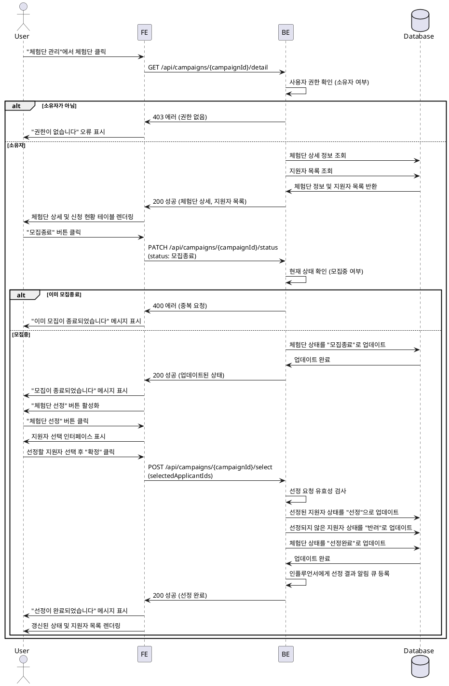

# 009 - 광고주 체험단 상세 & 모집 관리

## Primary Actor

- 광고주 역할의 사용자 (체험단 소유자)

## Precondition

- 사용자가 로그인되어 있고 광고주 역할이다.
- 사용자가 등록한 체험단이 존재한다.
- "체험단 관리" 페이지에서 특정 체험단을 선택한다.

## Trigger

- 사용자가 "체험단 관리" 페이지에서 특정 체험단을 클릭하여 상세 페이지로 이동한다.

## Main Scenario

1. 사용자가 체험단 목록에서 특정 체험단을 클릭한다.
2. 시스템은 체험단 상세 정보와 지원자 목록을 조회한다.
3. 시스템은 체험단 정보와 신청 현황 테이블을 표시한다 (지원자명, 각오 한마디, 방문 예정일자, 채널 정보 등).
4. 사용자가 "모집종료" 버튼을 클릭한다.
5. 시스템은 체험단 상태를 "모집중"에서 "모집종료"로 변경한다.
6. 시스템은 "체험단 선정" 버튼을 활성화한다.
7. 사용자가 "체험단 선정" 버튼을 클릭한다.
8. 시스템은 지원자 목록에서 선정할 인원을 선택할 수 있는 인터페이스를 표시한다.
9. 사용자가 선정할 지원자를 선택하고 "확정" 버튼을 클릭한다.
10. 시스템은 선정된 지원자의 상태를 "선정"으로, 선정되지 않은 지원자의 상태를 "반려"로 변경한다.
11. 시스템은 체험단 상태를 "선정완료"로 변경한다.
12. 시스템은 선정 완료 메시지를 표시하고, 인플루언서에게 선정 결과를 알린다.

## Edge Cases

- **지원자 없음**: 지원자가 없는 상태에서 "모집종료"를 클릭한 경우 경고 메시지 표시 및 확인 요청.
- **선정 인원 초과/부족**: 선정한 인원이 모집인원과 다른 경우 경고 메시지 표시 (유연하게 허용 가능).
- **이미 모집종료/선정완료**: 중복 요청 방지 및 현재 상태 안내.
- **DB 업데이트 실패**: 네트워크 또는 서버 오류 시 재시도 옵션 제공.
- **권한 없음**: 다른 광고주의 체험단에 접근 시 403 에러 표시.
- **알림 발송 실패**: 선정 결과 알림 발송 실패 시에도 상태는 변경되며, 별도 재시도 처리.

## Business Rules

- 광고주는 자신이 등록한 체험단만 관리할 수 있다.
- "모집종료"는 "모집중" 상태에서만 가능하다.
- "체험단 선정"은 "모집종료" 상태에서만 가능하다.
- 선정 완료 후에는 선정 결과를 변경할 수 없다 (또는 관리자 승인 필요).
- 선정된 인플루언서는 "선정" 상태로, 선정되지 않은 인플루언서는 "반려" 상태로 자동 업데이트된다.
- 선정 완료 후 인플루언서에게 푸시 알림 또는 이메일로 결과를 통보한다.

## Sequence Diagram

